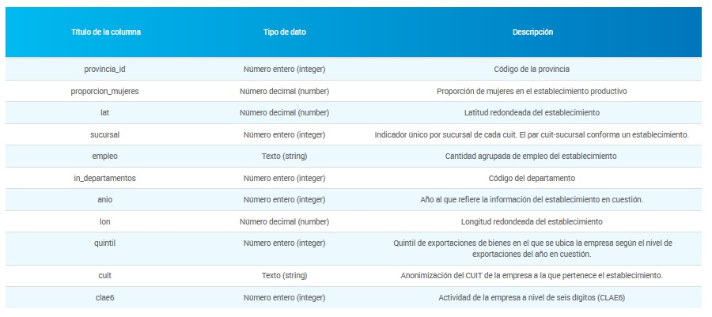
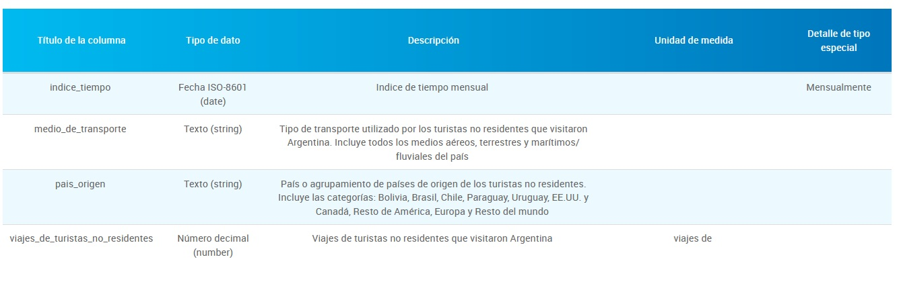
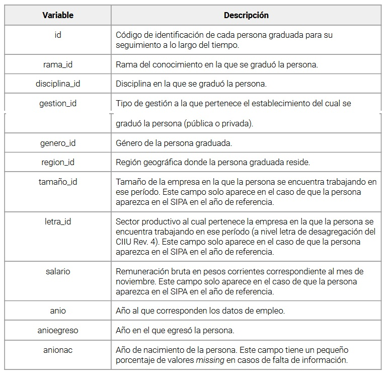
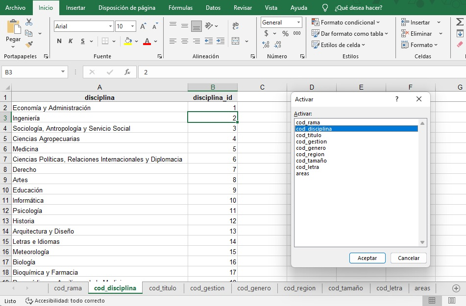
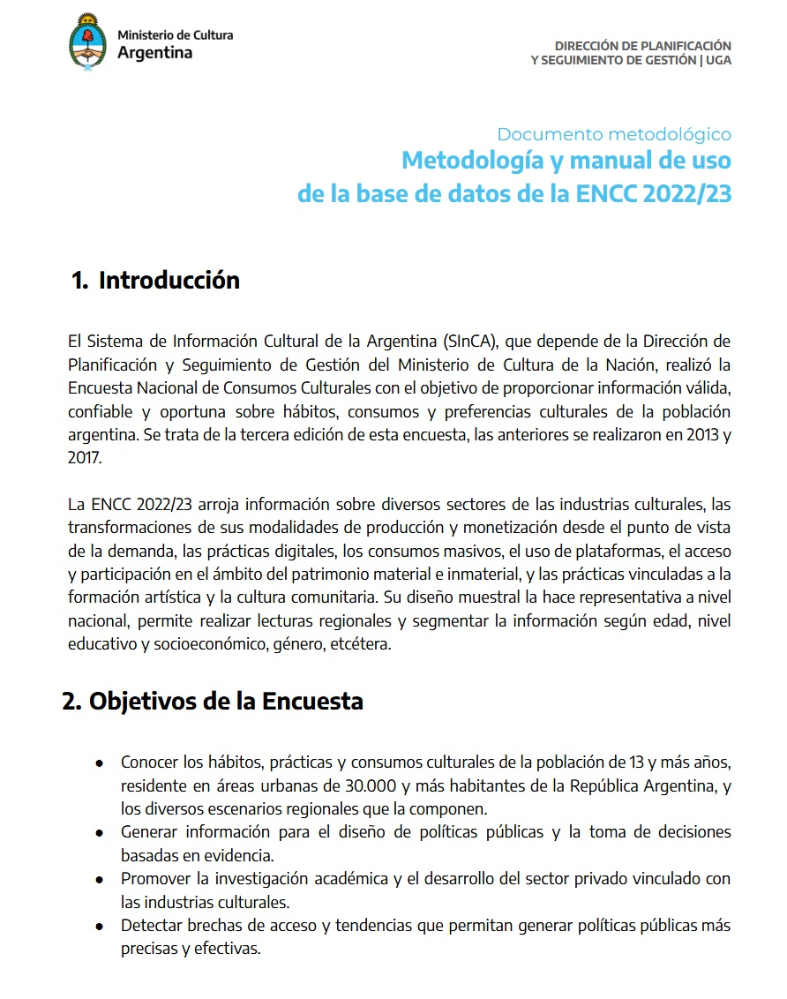
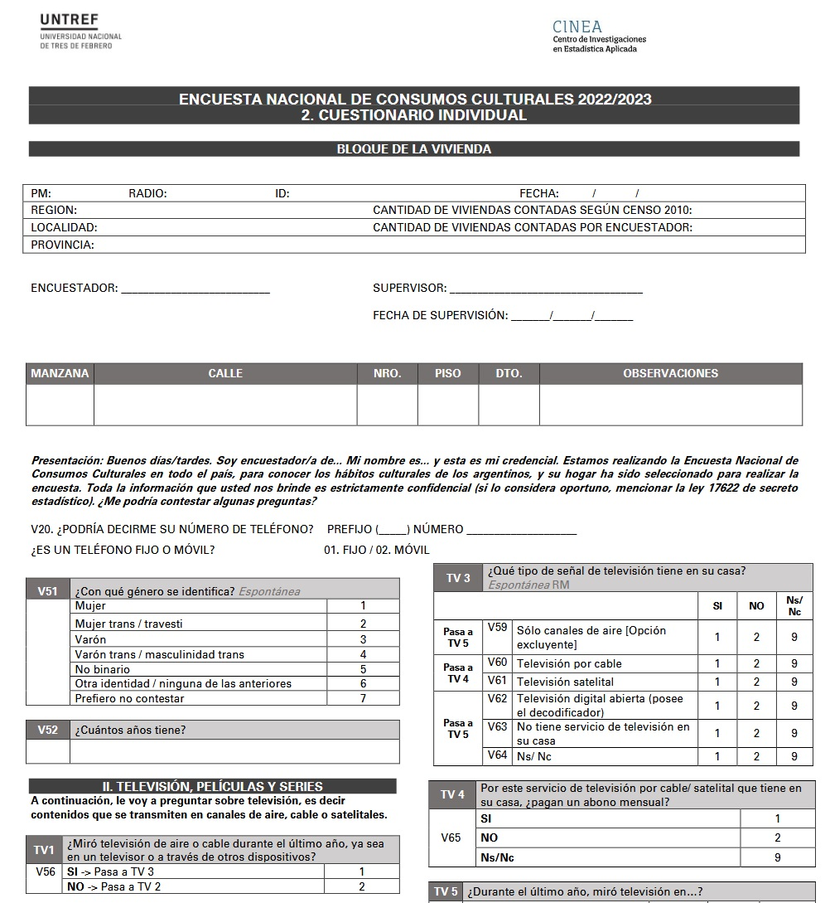
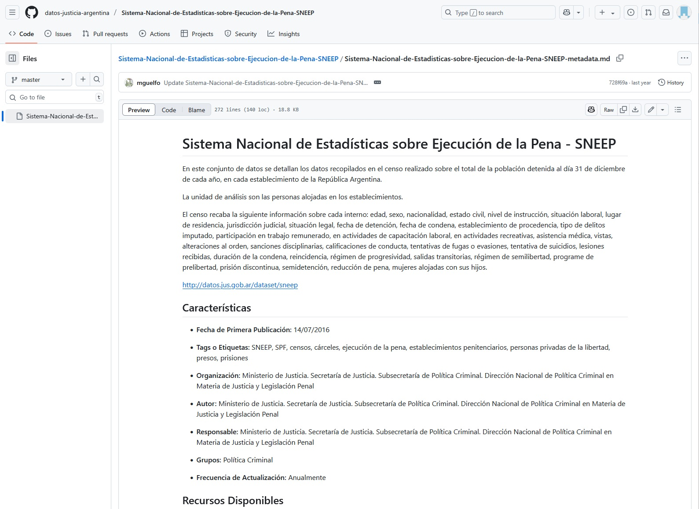

```{r echo=FALSE}
knitr::opts_chunk$set(dev.args = list(png = list(type = "cairo")))
```

# 1. DATOS ABIERTOS APN-ARG (recursos)

## 1.1. Introducción Marco

-   El portal de Datos Argentina (datos gob ar) es un sistema de información que recopila y organiza un conjunto de datos abiertos provenientes de muchas organizaciones y brinda un acceso único a los mismos.

-   Un portal de datos es un sistema de catálogos conformados por datasets (conjunto de datos) y metadatos que son las características que facilitan su comprensión. Los metadatos describen como está organizada la información y la política de gestión de acceso.

## 1.2. Esquema Diagrama

-   En el portal de Datos Argentina, el acceso a la información se estructura a través del sitio web <https://datos.gob.ar/> en el que, a través de iconos, pestañas, buscadores se procede a la búsqueda y acceso de los datos públicos. Otro modo de acceso es a través de las APIs.

-   Una API es una interfaz de programación de aplicaciones (la sigla API del inglés "Application Programming Interface). Esta interface, manipulada a través de códigos de programación permite consultas personalizadas del sistema que contiene los datos públicos.


# 2. FUENTES DE INFORMACIÓN (datasets)

## 2.1. Establecimientos Productivos

-   **Parámetros de Búsqueda**

|                       |                                                             |
|-----------------------|-------------------------------------------------------------|
| **Area de Gobierno:** | Economía y finanzas                                         |
| **Organizacion:**     | Secretaría de Planeamiento                                  |
| **Tags:**             | Empleo Empresas                                             |
| **DataSet (Titulo)**  | Distribución geográfica de los establecimientos productivos |

|                          |                                                                                                                                                                                                                                                                                                                                                                                                                                          |
|--------------------------|------------------------------------------------------------------------------------------------------------------------------------------------------------------------------------------------------------------------------------------------------------------------------------------------------------------------------------------------------------------------------------------------------------------------------------------|
| **Area de Gobierno:**    | Economía y finanzas                                                                                                                                                                                                                                                                                                                                                                                                                      |
| **Organizacion:**        | Secretaría de Planeamiento                                                                                                                                                                                                                                                                                                                                                                                                               |
| **Tags:**                | Empleo Empresas                                                                                                                                                                                                                                                                                                                                                                                                                          |
| **DataSet (Titulo)**     | Distribución geográfica de los establecimientos productivos                                                                                                                                                                                                                                                                                                                                                                              |
| **Descripción (notas):** | Datos correspondientes al Sistema Integrado Previsional Argentino y al Sistema de Alta Temprana -Simplificación Registral- de AFIP. Cuenta con información geográfica de los establecimientos productivos del país con sus respectivas desagregaciones sectoriales. Información elaborada por el CEP XXI en conjunto con la Subsecretaría de Planificación, Estudios y Estadísticas del Ministerio de Trabajo, Empleo y Seguridad Social |

-   **Descarga de Datos (archivo)**

**Paso 1:** Identificar link del archivo de datos (csv).

Cargar a la memoria del entorno: en nuestro caso lo denominamos "url_1"

```{r}

url_1 <- "https://cdn.produccion.gob.ar/cdn-cep/establecimientos-productivos/distribucion_establecimientos_productivos_sexo.csv"

```

**Paso 2:** identificar el link donde esta alojado el archivo de datos (csv) y cargarlo a la memoria del entorno (en nuestro caso lo denominamos "url_1")

```{r}

library(readr)  

geo_estab_produc <- read_csv(url_1)

```

**Paso 3:** Exploración Inicial del archivo de datos

estructura Variables/ campos

```{r echo=FALSE}

dicc_geo_estab <- data.frame(
  variable = names(geo_estab_produc),
  tipo = sapply(geo_estab_produc, function(x) class(x)[1]),
  stringsAsFactors = FALSE
)

dicc_geo_estab
 
```

-   **Definiciones: metodología, diccionarios, códigos**

-   La metodología hace referencia a las definiciones conceptuales del proceso de recolección de la información. En este caso...

-   El diccionario del archivo de datos, es fundamental para comprender a qué hace referencia cada uno de las variables de recurso como así también para entender la codificación de los datos.

-   A continuación...

[SITIO WEB DOCUMENTACION](https://cdn.produccion.gob.ar/cdn-cep/establecimientos-productivos/Metodologia_establecimiento_productivos.pdf)



## 2.2. Turismo Emisivo y Receptivo

-   **Parámetros de Búsqueda**

|                       |                                                  |
|-----------------------|--------------------------------------------------|
| **Area de Gobierno:** | Gobierno y sector público / Población y sociedad |
| **Organizacion:**     | Subsecretaría de Turismo                         |
| **Tags (etiquetas):** | turismo internacional                            |
| **DataSet (Titulo)**  | Turismo Receptivo / Turismo Emisivo              |

|                          |                                                                                                                                                                                                                                                                                                                                                                                                                                           |
|--------------------------|-------------------------------------------------------------------------------------------------------------------------------------------------------------------------------------------------------------------------------------------------------------------------------------------------------------------------------------------------------------------------------------------------------------------------------------------|
| **Area de Gobierno:**    | Gobierno y sector público / Población y sociedad                                                                                                                                                                                                                                                                                                                                                                                          |
| **Organizacion:**        | Subsecretaría de Turismo                                                                                                                                                                                                                                                                                                                                                                                                                  |
| **Tags (etiquetas):**    | turismo internacional                                                                                                                                                                                                                                                                                                                                                                                                                     |
| **DataSet (Titulo)**     | Turismo Receptivo / Turismo Emisivo                                                                                                                                                                                                                                                                                                                                                                                                       |
| **Descripción (notas):** | Estadísticas de turismo internacional referidas a los viajes de turistas no residentes (turismo receptivo), residentes (emisivos) y saldo entre receptivo y emisivo (balanza) a nivel país, por todos los medios de transporte utilizados (aéreos, terrestres, fluviales y marítimos). Datos en base a la información de la Dirección Nacional de Migraciones y de la Encuesta de Turismo Internacional (INDEC-Subsecretaría de Turismo). |

-   **Descarga de Datos (archivo)**

**Paso 1:** Identificar link del archivo de datos (csv).

Cargar a la memoria del entorno: en nuestro caso lo denominamos "url_21" y "url_22"

```{r}

url_21 <-"https://datos.yvera.gob.ar/dataset/4cbf7d4a-702a-4911-8c1e-717a45214902/resource/fdfe0ae4-4acc-4421-aa48-6149a02bc615/download/turistas-no-residentes-serie.csv"

url_22 <-"https://datos.yvera.gob.ar/dataset/4cbf7d4a-702a-4911-8c1e-717a45214902/resource/fd710cb7-1981-43ea-aba3-7a14c356446b/download/turistas-residentes-serie.csv"


```

**Paso 2:** identificar el link donde esta alojado el archivo de datos (csv) y cargarlo a la memoria del entorno (en nuestro caso lo denominamos "url_1")

```{r}
 
turismo_receptivo <- read_delim(url_21, delim = ",")

turismo_emisivo <- read_delim(url_22, delim = ",")

```

**Paso 3:** Exploración Inicial del archivo de datos

```{r}

dicc_turis_rec <- data.frame(
  variable = names(turismo_receptivo),
  tipo = sapply(turismo_receptivo, function(x) class(x)[1]),
  stringsAsFactors = FALSE
)

dicc_turis_rec
```

estructura Variables/ campos

```{r}

dicc_turis_emi <- data.frame(
  variable = names(turismo_emisivo),
  tipo = sapply(turismo_emisivo, function(x) class(x)[1]),
  stringsAsFactors = FALSE
)

dicc_turis_emi
 
```

-   **Definiciones: metodología, diccionarios, códigos**

-   En este caso, se cuenta con una Ficha Técnica del recurso en el que se detalla el marco conceptual, consideraciones metodológicas y una descripción de las estadísticas de turismo internacional que se ponen a disposición en datos públicos.

-   Otro aspecto relevante es que en el mismo sitio de Datos Argentina se detallan y describen los campos de información que contiene el repositorio estructurado (csv).

[SITIO WEB DOCUMENTACION](https://datos.yvera.gob.ar/dataset/4cbf7d4a-702a-4911-8c1e-717a45214902/resource/200bf770-d6f2-4847-af20-678fc0f13a0f/download/tur-inter-data.pdf)



## 2.3. Graduados Universitarios

-   **Parámetros de Búsqueda**

|                       |                                                                                        |
|-----------------------|----------------------------------------------------------------------------------------|
| **Area de Gobierno:** | Economía y finanzas                                                                    |
| **Organizacion:**     | Secretaría de Planeamiento y Gestión para el Desarrollo Productivo y de la Bioeconomía |
| **Tags (etiquetas):** | Brechas Salariales / Educacion                                                         |
| **Titulo (DataSet):** | Graduados universitarios del sistema Araucano (2016-2018)                              |

======= \| \| \| \|--------------\|---------------------------------------------------------\| \| **Area de Gobierno:** \| Economía y finanzas \| \| **Organizacion:** \| Secretaría de Planeamiento y Gestión para el Desarrollo Productivo y de la Bioeconomía \| \| **Tags (etiquetas):** \| Brechas Salariales / Educacion \| \| **Titulo (DataSet):** \| Graduados universitarios del sistema Araucano (2016-2018) \| \| **Descripción (notas):** \| Base de datos que contiene, para el período 2019-2021, información sociolaboral de un conjunto de graduados de carreras universitarias de universidades argentinas entre 2016 y 2018. \|

-   **Descarga de Datos (archivo)**

**Paso 1:** Identificar link del archivo de datos (csv).

Cargar a la memoria del entorno: en nuestro caso lo denominamos "url_1"

```{r}

url_3 <- "https://datos.produccion.gob.ar/dataset/46df1ebe-d0bb-49a1-96dd-fe9751930682/resource/afbfc04e-6130-448c-953f-ef601f3e8bda/download/base_araucano.csv"

```

**Paso 2:** identificar el link donde esta alojado el archivo de datos (csv) y cargarlo a la memoria del entorno (en este caso "url_3")

```{r}


graduados_univer <- read_delim(url_3, delim = ",")

```

**Paso 3:** Exploración Inicial del archivo de datos

estructura Variables/ campos

```{r}

dicc_grad_univ <- data.frame(
  variable = names(graduados_univer),
  tipo = sapply(graduados_univer, function(x) class(x)[1]),
  stringsAsFactors = FALSE
)

dicc_grad_univ
 
```

-   **Definiciones: metodología, diccionarios, códigos**

-   En el caso de la Base Araucano, se cuenta con una Ficha sintética que detalla muy brevemente el marco teórico-metodológico.

-   En este caso los campos de información que contiene el repositorio estructurado (csv) no estan en el portal de Datos Argentina, sino en el documento-ficha.

-   Aquí, se cuenta con un archivo en formato excel en que se específican las codificaciones de las categorías cada una de las variables cualitativas que contiene el recurso.

    [SITIO WEB DOCUMENTACION](https://datos.produccion.gob.ar/dataset/46df1ebe-d0bb-49a1-96dd-fe9751930682/resource/a2b14e98-9874-4b2a-b641-cdba6676de45/download/metodologia-araucano-da.pdf)



[SITIO WEB DOCUMENTACION](https://datos.gob.ar/dataset/produccion-graduados-universitarios-sistema-araucano-2016-2018/archivo/produccion_2976f8e2-eb30-412f-a3cf-0a445452a037)



## 2.4. Consumos Culturales

-   **Parámetros de Búsqueda**

|                       |                                                                |
|-----------------------|----------------------------------------------------------------|
| **Area de Gobierno:** | Educación, cultura y deportes / Población y sociedad           |
| **Organizacion:**     | Secretaría de Cultura                                          |
| **Tags (etiquetas):** | Consumos Culturales / Encuesta Nacional de Consumos Culturales |
| **Titulo (DataSet):** | Encuesta Nacional de Consumos Culturales 2022-2023             |

======= \| \| \| \|---------------\|---------------------------------------------------------\| \| **Area de Gobierno:** \| Educación, cultura y deportes / Población y sociedad \| \| **Organizacion:** \| Secretaría de Cultura \| \| **Tags (etiquetas):** \| Consumos Culturales / Encuesta Nacional de Consumos Culturales \| \| **Titulo (DataSet):** \| Encuesta Nacional de Consumos Culturales 2022-2023 \| \| **Descripción (notas):** \| La Encuesta Nacional de Consumos Culturales busca conocer en profundidad el comportamiento de la población argentina respecto de los hábitos y consumos culturales. \|

-   **Descarga de Datos (archivo)**

**Paso 1:** Identificar link del archivo de datos (csv).

Cargar a la memoria del entorno: en nuestro caso lo denominamos "url_1"

```{r}

url_4 <- "https://datos.cultura.gob.ar/dataset/251c2ac2-e670-451c-9dbf-a4212af225b5/resource/b635d1fc-2161-4901-a21d-7f93d56d99a4/download/base-datos-encc-2022-2023.csv"

```

**Paso 2:** identificar el link donde esta alojado el archivo de datos (csv) y cargarlo a la memoria del entorno (en nuestro caso lo denominamos "url_1")

```{r}

library(readr)  

consumos_cult_22 <- read_delim(url_4, delim = ",")

```

**Paso 3:** Exploración Inicial del archivo de datosestructura Variables/ campos

```{r}

dicc_cons_cult <- data.frame(
  variable = names(consumos_cult_22),
  tipo = sapply(consumos_cult_22, function(x) class(x)[1]),
  stringsAsFactors = FALSE
)

dicc_cons_cult
```

-   **Definiciones: metodología, diccionarios, códigos**

-   En el caso de la ENCC, se cuenta con documento que específica marco conceptual, objetivos, metodológia la encuesta de consumo que se encuentra a disposición en datos públicos.

-   Un aspecto a tomar en cuenta es que los microdatos de la encuesta presentan ponderadores (a diferencia de los recursos anteriores) y se explicitan algunas nociones sobre los mismos. Asi también, se pone a disposición el cuestionario (instrumento) aplicado en el relevamiento.

-   En este recurso, los campos de información y las codificaciones que contiene el archivo estructurado (csv) no estan en el portal de Datos Argentina.

[SITIO WEB DOCUMENTO METODOLOGICO](https://datos.cultura.gob.ar/dataset/251c2ac2-e670-451c-9dbf-a4212af225b5/resource/da9823d4-543b-4efc-bb43-13d9df7344d5/download/metodologia-manual-uso-base-datos-encc-2022-2023.pdf)



[SITIO WEB CUESTIONARIO](https://datos.cultura.gob.ar/dataset/251c2ac2-e670-451c-9dbf-a4212af225b5/resource/7f0af926-e365-4e9e-bb4f-a70a3bffe416/download/cuestionario-encc-2022-2023.pdf)



## 2.5. Poblacion Carcelaria

-   **Parámetros de Búsqueda**

|                       |                                                                             |
|-----------------------|-----------------------------------------------------------------------------|
| **Area de Gobierno:** | Justicia, seguridad y legales                                               |
| **Organizacion:**     | Ministerio de Justicia                                                      |
| **Tags (etiquetas):** | SPF / Sistema Penitenciario                                                 |
| **Titulo (dataset):** | CENSO. Sistema Nacional de Estadísticas sobre Ejecución de la Pena - - 2023 |

======= \| \| \| \|-------------\|-----------------------------------------------------------\| \| **Area de Gobierno:** \| Justicia, seguridad y legales \| \| **Organizacion:** \| Ministerio de Justicia \| \| **Tags (etiquetas):** \| SPF / Sistema Penitenciario \| \| **Titulo (dataset):** \| CENSO. Sistema Nacional de Estadísticas sobre Ejecución de la Pena - - 2023 \| \| **Descripción (notas):** \| Información recopilada en el censo realizado sobre el total de la población detenida al día 31 de diciembre de cada año, en cada establecimiento de la República Argentina. Este recurso contiene el censo del Sistema Nacional de Estadísticas sobre Ejecución de la Pena correspondiente al año 2023. \|

-   **Descarga de Datos (archivo)**

**Paso 1:** Identificar link del archivo de datos (csv).

Cargar a la memoria del entorno: en nuestro caso lo denominamos "url_1"

```{r}

ruta_5 <- "C:/Users/alban/repositorios/seminario_UBA_2025/sneep-2023.csv"

```

**Paso 2:** identificar el link donde esta alojado el archivo de datos (csv) y cargarlo a la memoria del entorno (en nuestro caso lo denominamos "url_1")

```{r}

library(readr)  

serv_penitenciario <- read_csv("https://datos.jus.gob.ar/dataset/6c03af36-6a1d-4306-b2a8-dd39ad73afb3/resource/2fc756fc-e531-4562-8343-91f810b9fa1b/download/sneep-2023.csv")

```

**Paso 3:** Exploración Inicial del archivo de datos

estructura Variables/ campos

```{r}

dicc_serv_penit <- data.frame(
  variable = names(serv_penitenciario),
  tipo = sapply(serv_penitenciario, function(x) class(x)[1]),
  stringsAsFactors = FALSE
)

dicc_serv_penit
 
```

-   **Definiciones: metodología, diccionarios, códigos**

-   A diferencia de todos los recursos anteriores presentados, este archivo de datos presenta la ficha y documentación asociada en el repositorio GitHub.

-   Los campos de información y las codificaciones que contiene el archivo estructurado (csv) no estan en el portal de Datos Argentina sino en el mismo repositorio GitHub como formato plano de texto.

-   Otro aspecto novedoso de este recurso (a diferencia de los anteriores) es que se presenta en el mismo portal de Datos Argentina, un sistema de visualizadores dinámicos de información. Este posibilita generar graficos interactivos y descargarlos.

[GITHUB DOCUMENTO METODOLOGICO](https://github.com/datos-justicia-argentina/Sistema-Nacional-de-Estadisticas-sobre-Ejecucion-de-la-Pena-SNEEP/blob/master/Sistema-Nacional-de-Estadisticas-sobre-Ejecucion-de-la-Pena-SNEEP-metadata.md)



```{r}

library(dplyr)
library(purrr)

pares <- list(
  genero              = c("genero_id", "genero_descripcion"),
  estado_civil        = c("estado_civil_id", "estado_civil_descripcion"),
  nivel_instruccion   = c("nivel_instruccion_id", "nivel_instruccion_descripcion"),
  ultima_situacion_laboral = c("ultima_situacion_laboral_id", "ultima_situacion_laboral_descripcion")
)

tabla_correspondencia <- pares |>
  imap_dfr(\(cols, nombre) {
    serv_penitenciario |>
      select(codigo = !!sym(cols[1]), descripcion = !!sym(cols[2])) |>
      distinct() |>
      mutate(variable = nombre)
  }) |>
  arrange(variable, codigo) |>
  select(variable, codigo, descripcion)

tabla_correspondencia


 
```
