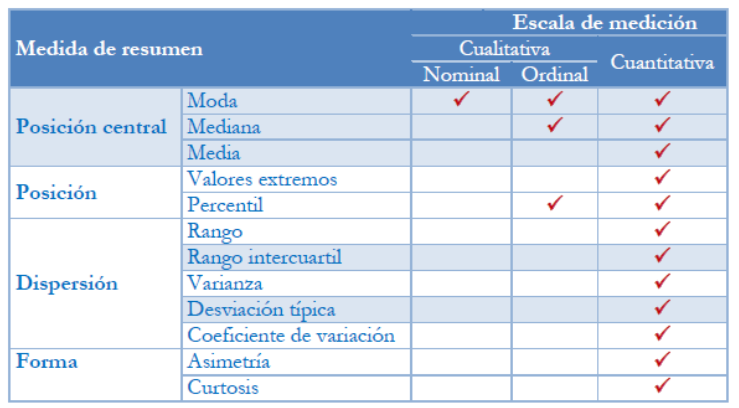
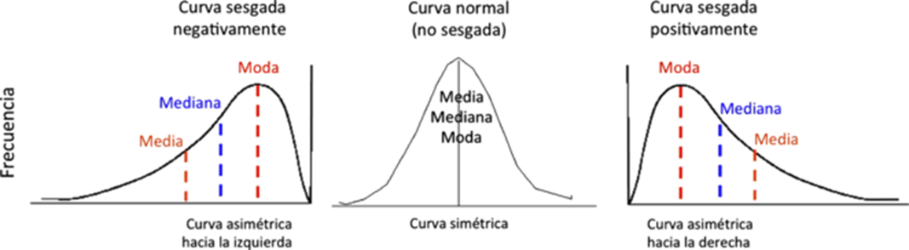
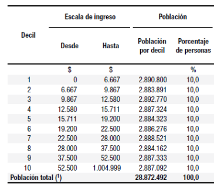
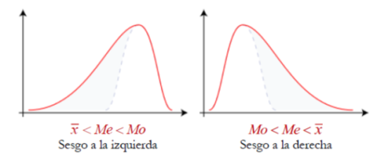
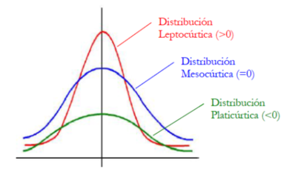

# Resumen y agregación de datos

Frecuentemente necesitamos resumir la información de muchas observaciones en un único valor. Por ejemplo, si queremos calcular el promedio de edad o de ingresos, o cualquier otra medida de tendencia central, lo que estamos haciendo es resumir la información de una variable en un único valor.

Otras veces, nuestra variable es de tipo categórica y queremos conocer la frecuencia de cada categoría en el total de la población. Es común, a partir de los datos censales o de encuestas de hogares, calcular tasas de actividad, de empleo, de analfabetismo, o razones masculinidad o femineidad, entre otras. En estos casos, previo al conteo de casos, necesitaremos agrupar a la población en las categorías de interés.

Para ello, en este apartado, revisaremos el uso de las funciones `summarise()` y `group_by()` del paquete `dplyr` para resumir y agregar datos.

## Librerías

Para esta clase, necesitaremos tener instaladas las siguientes librerías:

```{r eval=FALSE}
install.packages("summarytools")
```

## Base de datos y librerías

Para revisar estas funciones utilizaremos la base del **censo del Sistema Nacional de Estadísticas sobre Ejecución de la Pena de 2023** (SNEEP), los datos de **Turismo emisivo** y de la **Encuesta Nacional de Consumos Culturales**. Para ello, volveremos a descargar los datos y seguiremos usando los paquetes del `tidyverse`.

```{r}
library(tidyverse)

censo_sneep <- read_csv("https://datos.jus.gob.ar/dataset/6c03af36-6a1d-4306-b2a8-dd39ad73afb3/resource/2fc756fc-e531-4562-8343-91f810b9fa1b/download/sneep-2023.csv")

turismo_emisivo <- read_csv("https://datos.yvera.gob.ar/dataset/4cbf7d4a-702a-4911-8c1e-717a45214902/resource/fd710cb7-1981-43ea-aba3-7a14c356446b/download/turistas-residentes-serie.csv")

consumos_culturales <- read_csv("https://datos.cultura.gob.ar/dataset/251c2ac2-e670-451c-9dbf-a4212af225b5/resource/b635d1fc-2161-4901-a21d-7f93d56d99a4/download/base-datos-encc-2022-2023.csv")

```

## Uso de ponderadores para las estimaciones  

Generalmente las encuestas de hogares o de individuos como la *EPH*, el *Latinobarómetro* o, en nuestro caso, la *Encuesta Nacional de Consumos Culturales* (ENCC), al ser relevamientos realizados con muestreos probabilísticos, utilizan ponderadores para corregir el sesgo de la muestra. Es decir, permiten ajustar en los casos en que determinadas poblaciones se encuentran sub-representadas o sobre-representadas en la muestra. Los ponderadores son variables de tipo numéricas que *multiplican* el valor de cada caso para alcanzar una estimación más cercana a la realidad sobre la que se quiere investigar.  

En el caso de la **ENCC** contamos con dos variables de ponderación:  
- *ponderador*: factor de corrección muestral  
- *expansor*: coeficiente de corrección muestral y expansión de totales personas  

En los ejemplos que revisemos con la *ENCC* debemos estar atentos de siempre utilizar alguna de las variables de ponderación para realizar estimaciones correctas.  

## Estadísticas resumen

El análisis exploratorio de datos (**EDA** en inglés) funciona como una primera aproximación a las variables por separado. A la vez, nos sirve para observar si se cumplen determinados supuestos estadísticos.

Podemos clasificar cuatro tipos de estadísticas resumen: las de tendencia central, las de dispersión, las de forma y las de posición. Las primeras nos permiten resumir la información de una variable en un único valor, las segundas nos permiten conocer la variabilidad de los datos, las terceras nos permiten conocer la forma de la distribución de los datos y las últimas nos permiten identificar en que posición se ubican determinados valores de las variables.

{width="70%"}  


### Medidas de tendencia central

-   **Moda**: valor más frecuente / puede realizarse en cualquier nivel de medición

-   **Mediana**: valor que determina la posición central de la distribución de la variable

    -   Es el valor que divide a la distribución en dos mitades (p50)
    -   Solo interviene el orden de las categorías de las variables. No se ve afectada por los valores extremos
    -   Puede calcularse en variables ordinales y cuantitativas

-   **Media**: promedio aritmético de todos los valores de la variable

    -   Solo aplicable en variables cuantitativas
    -   Es necesaria acompañarla de medidas de dispersión
    -   Puede calcularse también la media ponderada, recortada, geométrica o armónica

{width="80%"}

### Medidas de posición

-   **Valores extremos**: mínimo y máximo de una distribución de datos
-   **Cuantiles**: nos proporcionan el valor de una variable que acumula un determinado número de casos.
    -   La mediana es el percentil 50
    -   Los cuantiles más conocidos son los cuartiles (25), quintiles (20) o deciles (10)



### Medidas de dispersión

Complementan la información de centralidad, dan cuenta del comportamiento de la distribución y permiten observar cuán homogéneos o heterogéneos son los datos.

-   **Rango**: diferencia entre el valor más grande y más pequeño de la distribución
-   **Rango intercuartil**: diferencia entre el tercer cuartil (p75) y el primer cuartil (p25)
-   **Varianza**: evalúa las distancias entre los valores particulares y el valor de la media
-   **Desvío estándar**: es la raíz cuadrada de la varianza. Permite restituir la unidad de medida de la variable
-   **Coeficiente de variación**: cociente entre desviación estándar y la media.
    -   Permite comparar entre distintas distribuciones.
    -   Se presenta en %

### Medidas de forma

-   **Simetría**: mide la simetría de la distribución de los datos
    -   Si es 0, la distribución es simétrica (curva normal)
    -   Si es positiva, la distribución es asimétrica hacia la derecha
    -   Si es negativa, la distribución es asimétrica hacia la izquierda

{width="60%"}

-   **Curtosis**: permite observar el grado de apuntalamiento o achatamiento que presenta una distribución respecto a la distribución normal
    -   Si es 0, la distribución es mesocúrtica (curva normal)
    -   Si es positiva, la distribución es leptocúrtica (más puntiaguda)
    -   Si es negativa, la distribución es platicúrtica (más achatada)

{width="60%"}

### Calculando medidas resumen en `R`

`R base` cuenta con una función que nos permite calcular estadísticos resumen de una variable de forma rápida y simple, la función `summary()`. Por ejemplo, si quisiéramos estimar el promedio de edad de la población carcelaria en 2023, y otros estadísticos descriptivos, podríamos hacerlo de la siguiente forma:

```{r}
summary(censo_sneep$edad)
```

De este modo, observamos que la edad promedio es `r round(mean(censo_sneep$edad), digits = 2)`, la mediana es `r median(censo_sneep$edad)` y la edad máxima es `r max(censo_sneep$edad)`.  

El único problema con la función `summary()` es que no nos permite calcular estadísticos ponderados. En el caso de la base censal del *SNEEP* no hay problema porque estamos trabajando con un *censo* en lugar de una muestra. Sin embargo, si quisieramos trabajar con datos muestrales existe una librería llamada `summarytools` que nos permite agregar el argumento `weights` para calcular las estadísticas ponderadas. Por ejemplo, si quisiéramos calcular el promedio de edad de la población encuestada en la *ENCC* utilizando el ponderador *ponderador*, podríamos hacerlo de la siguiente forma utilizando la función `descr()`:  

```{r}
library(summarytools)  

descr(consumos_culturales$edad, weights = consumos_culturales$ponderador)
```


En `dplyr`, la función `summarise()` nos permite realizar el mismo cálculo de forma más ordenada y clara. Por ejemplo, si quisiéramos calcular el promedio de edad de la población (variable CH06), podríamos hacerlo de la siguiente forma:

```{r}
consumos_culturales %>% 
  summarise(promedio_edad = weighted.mean(edad, w = ponderador, na.rm = TRUE)) #ponderado

consumos_culturales %>% 
  summarise(promedio_edad = mean(edad, na.rm = TRUE)) #sin ponderado

```

`summarise` acepta toda una serie de estadísticos básicos que pueden utilizar:

-   `mean()`: promedio
-   `weighted.mean()`: promedio ponderado
-   `median()`: mediana
-   `min()`: mínimo
-   `max()`: máximo
-   `sd()`: desviación estándar
-   `var()`: varianza
-   `n()`: número de observaciones
-   `sum()`: suma
-   `first()`: primer valor
-   `last()`: último valor
-   `n_distinct()`: número de valores distintos

```{r}
censo_sneep %>%
  summarise(promedio_edad = mean(edad),
            mediana_edad = median(edad),
            min_edad = min(edad),
            max_edad = max(edad),
            sd_edad = sd(edad))

```

De este modo, la función `summarise` nos permite calcular múltiples estadísticos de forma rápida y sencilla y nos devuelve un *data frame* con un valor para cada estadístico calculado.  

::: {.callout-tip title="Para revisar"}
La mayoría de los estadísticos descriptivos y de dispersión que nos brinda `Rbase` no nos permite utilizar ponderadores. Por lo tanto, si queremos calcular estadísticos ponderados puntuales debemos utilizar otras librerías. Les recomendamos inspeccionar las librerías `survey` y `DescTools`.
:::


## Agregación de datos {#sec-agregacion}

Otra forma de realizar resúmenes o cálculos sobre las variables es a partir de la información agrupada. Frecuentemente necesitamos que nuestras estadísticas sean calculadas por grupos de edad, sexo, nivel educativo, provincia de residencia, país, etc. Para ello, utilizamos la función `group_by()`, que como su nombre lo indica, nos agrupa la información en base a una variable (o más). En términos de la matriz de datos, lo que hace es cambiar la unidad de análisis: de personas a grupos de edad, por ejemplo.

Si quisiéramos calcular el promedio de edad de la población carcelaria por sexo podríamos seguir las siguientes instrucciones:

```{r}
censo_sneep %>% 
  group_by(genero_descripcion) %>% # Agrupamos por sexo
  summarise(promedio_edad = mean(edad, na.rm = TRUE)) # Calculamos el promedio de edad
```

Fíjense que utilizando los *pipes* es sencillo encadenar cada una de las funciones. Primero agrupamos la información por sexo y luego calculamos el promedio de edad. 

Otro ejemplo que podemos realizar, utilizando los datos de la *Subsecretaría de Turismo*, es calcular la cantidad de turistas que han viajado por año a los distintos países destino clasificados. Recuerden que la base de turismo emisivo (y receptivo) se basa en un conteo de los turistas que salen (o entran) de Argentina por día y por medio de transporte. Nosotros vamos a *agregar los datos* para que obtengamos el valor por año, sin importar el medio de transporte de salida.  

Como el dato de la fecha se guarda en la variable `indice_tiempo` bajo el formato *aaaa-dd-mm*, nosotros a través de la función *year* de la librería `lubridate`. vamos a extraer únicamente el año y asignarlo a una nueva variable de nombre *anio*.  

Entonces, recapitulando:  

1. Creamos la variable *anio* usando la función *year* dentro de *mutate*  
2. Agrupamos por año y por país de destino, ya que queremos que haya una fila para cada año y país  
3. A través de la función *sum* dentro de *summarise* calculamos la suma de turistas por año y país. 


```{r}
library(lubridate)

turismo_emisivo %>% 
  mutate(anio = year(indice_tiempo)) %>% 
  group_by(anio, pais_destino) %>% 
  summarise(turistas = sum(viajes_de_turistas_residentes))

```

Si dejamos así el script, los cambios no se asignarán a nuestro objeto `turismo_emisivo`. Para hacerlo debemos asignarlo explicitamente a un nuevo objeto, para no sobreescribir la base original:  

```{r}
turismo_emisivo_aniopais <- turismo_emisivo %>% 
  mutate(anio = year(indice_tiempo)) %>% 
  group_by(anio, pais_destino) %>% 
  summarise(turistas = sum(viajes_de_turistas_residentes))

```

```{r echo=FALSE}
DT::datatable(turismo_emisivo_aniopais)
```


Fijense que mientras que la base `turismo_emisivo` tiene `r  nrow(turismo_emisivo)` casos, la base `turismo_emisivo_aniopais` tiene `r  nrow(turismo_emisivo_aniopais)` ¿A qué se debe está disminución en la cantidad de filas?  


### Replicando indicadores publicados

Vamos a tomar como ejemplo el informe  [Encuesta Nacional de Consumos Culturales 2022/2023](https://back.sinca.gob.ar/download.aspx?id=3443){target="_blank"}, los datos del *dashboard* del [censo de SNEEP](https://datos.jus.gob.ar/ro/dataset/sneep/archivo/5de62f46-aaf3-4d08-9002-7198d703963c){target="_blank"} y el [informe estadísticas de turismo de junio de 2025 de INDEC](https://www.indec.gob.ar/uploads/informesdeprensa/eti_06_256083EEBF86.pdf){target="_blank"} para practicar el uso de `group_by` y `summarise`.


**Porcentaje de personas en el Servicio Penitenciario según situación legal**: Calcularemos la cantidad y el porcentaje de personas que según el tipo de situación legal en la que se encuentran (condenado/a, procesado/a, inimputable).  


```{r}
#Cantidad
censo_sneep %>% 
  group_by(situacion_legal_descripcion) %>% 
  summarise(cantidad = n()) # Con n() contamos la cantidad de casos por situación legal

#Porcentaje
censo_sneep %>% 
  group_by(situacion_legal_descripcion) %>% 
  summarise(cantidad = n()) %>%   # Con n() contamos la cantidad de casos por situación legal
  mutate(porcentaje = (cantidad / sum(cantidad)) * 100) # Calculamos el porcentaje de personas por situación legal


```

Fijense que para calcular el porcentaje, luego de aplicar *summarise* y obtener la cantidad de casos por categoría, debemos usar mutate, ya que vamos a crear una nueva columna sobre nueva base agregada que creamos.  


**Porcentaje de personas que asisten a museos**: Calcularemos el porcentaje de personas que asisten a museos según nivel socio-económico. Para ello, utilizaremos la variable *pat1* y *nse_3*. Recordar que debemos utilizar el *ponderador* para realizar las estimaciones correctas.

```{r}

consumos_culturales %>% 
  group_by(nse_3, pat1) %>% # Agrupamos por nivel socio-económico y asistencia a museos
  summarise(total = sum(ponderador, na.rm = TRUE)) %>% # Sumamos los casos por nivel socio-económico y asistencia a museos
  group_by(nse_3) %>% # Agrupamos por nivel socio-económico
  summarise(porcentaje_museos = (total[pat1 == "SI"] / sum(total)) * 100) # Calculamos el porcentaje de personas que asisten a museos
  
```

¿Las estimaciones son correctas?  


**Géneros mirados en plataformas**: Calcularemos el porcentaje de personas que miran contenidos audiovisuales en plataformas de streaming, agrupados por género. Para ello, utilizaremos la serie de variables comprendidas entre la *tv15_1* a *tv15_11* que indican si se mira o no cada género. Para cada variable, el valor 1 representa que la persona mira ese género y el valor 0 que no lo mira. Entonces, para calcular el porcentaje de personas que miran cada género, debemos:

```{r}
consumos_culturales %>% 
  summarise(accion_aventura = sum(ponderador[tv15_1 == 1], na.rm = T) / sum(ponderador, na.rm = T),
            ciencia_ficcion = sum(ponderador[tv15_2 == 1], na.rm = T) / sum(ponderador, na.rm = T),
            suspenso = sum(ponderador[tv15_3 == 1], na.rm = T) / sum(ponderador, na.rm = T),
            terror = sum(ponderador[tv15_4 == 1], na.rm = T) / sum(ponderador, na.rm = T),
            drama = sum(ponderador[tv15_5 == 1], na.rm = T) / sum(ponderador, na.rm = T),
            comedia = sum(ponderador[tv15_6 == 1], na.rm = T) / sum(ponderador, na.rm = T),
            romantico = sum(ponderador[tv15_7 == 1], na.rm = T) / sum(ponderador, na.rm = T),
            documental = sum(ponderador[tv15_8 == 1], na.rm = T) / sum(ponderador, na.rm = T),
            infantiles = sum(ponderador[tv15_9 == 1], na.rm = T) / sum(ponderador, na.rm = T),
            entretenimiento_reality = sum(ponderador[tv15_10 == 1], na.rm = T) / sum(ponderador, na.rm = T),
            animacion = sum(ponderador[tv15_11 == 1], na.rm = T) / sum(ponderador, na.rm = T))
            
  
```

Luego veremos como presentar estos resultados en formato más ordenado, organizando los géneros en una sola columna. 

**Cantidad de turismo emisivo en el mes de mayo de 2025 por país de destino**: En el [informe estadísticas de turismo de junio de 2025 de INDEC](https://www.indec.gob.ar/uploads/informesdeprensa/eti_06_256083EEBF86.pdf){target="_blank"} hay distintos datos respectos al turismo emisivo y receptivo del país. Vamos a calcular la cantidad de personas que en mayo viajó a distintos destinos clasificados. 
Para hacer los cálculos, primero vamos a *extraer* el dato de mes y año, con la librería `lubridate` y lo vamos a asignar mediante *mutate* a dos nuevas variables. Eso lo asignaremos a un objeto con el mismo nombre (`turismo_emisivo`) para sobreescribirlo. Luego, ya podemos hacer los cálculos.  

Para poder quedarnos únicamente con el mes de mayo y el año 2025 debemos aplicar un filtro, para luego si poder agrupar los datos. Finalmente haremos la sumatoria, adentro de cada país de destino, de la cantidad de viajes identificados en la variable *viajes_de_turistas_residentes*.  


```{r}
#Reescribimos el objeto con variable anio y mes
turismo_emisivo <- turismo_emisivo %>% 
  mutate(mes = month(indice_tiempo),
         anio = year(indice_tiempo))

#Ahora si podemos hacer el cálculo
turismo_emisivo %>% 
  filter(anio == 2025 & mes == 5) %>% #Filtramos el año y mes de interés 
  group_by(pais_destino) %>% #Agrupamos por país de destino
  summarise(turistas = sum(viajes_de_turistas_residentes)) #Sumamos al interior de cada país 
  

```


