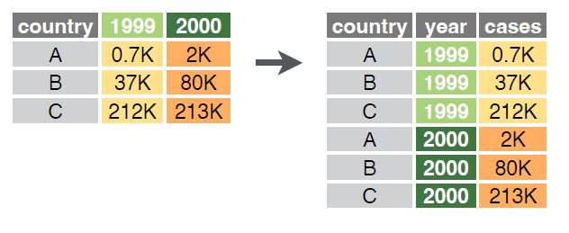
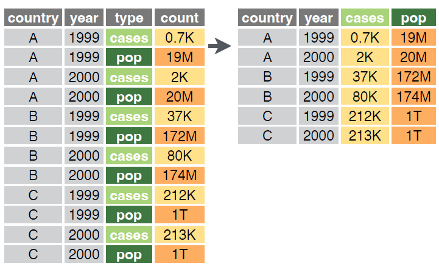
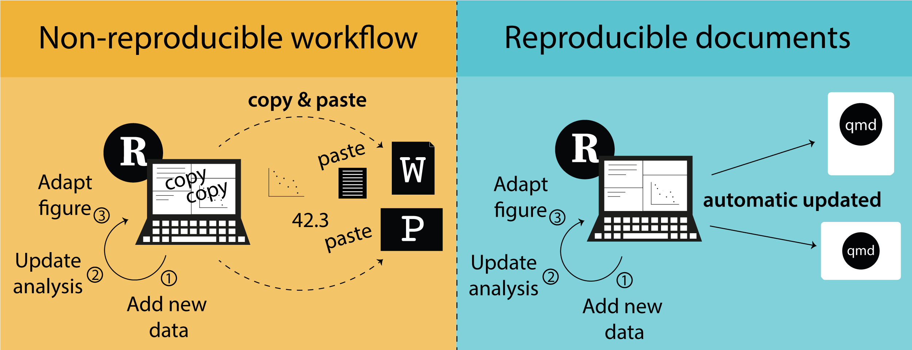
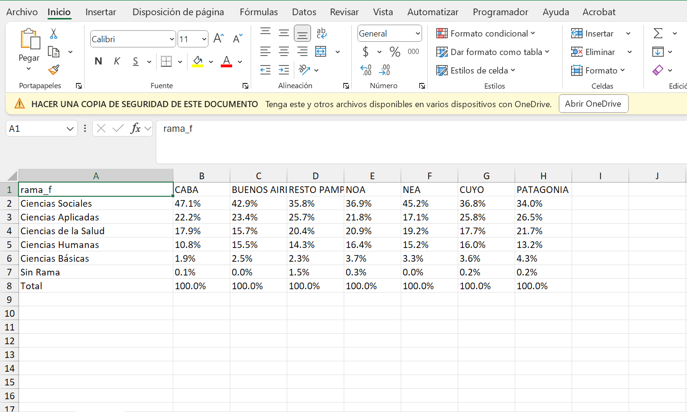
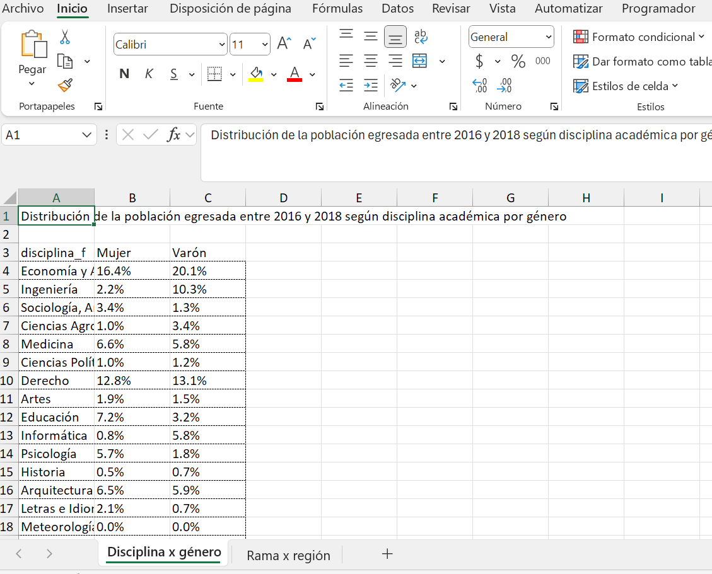

# Construcción de tablas

En esta apartado revisaremos distintas aproximaciones a la construcción de tablas de frecuencias y de tablas de contingencia. Quizás `R` no se destaque por la simpleza del análisis exploratorio a través de tablas, pero existen infinidad de paquetes que nos permitirán llegar a resultados similares. Empezaremos explorando la funciones disponibles en **R base**, luego revisaremos algunos paquetes que harán la mayor parte del trabajo por nosotros y, por último, veremos cómo podemos hacerlo con `dplyr` y `tidyr` de `tidyverse`.  

Para este apartado utilizaremos la base de graduados universitarios de 2016-2018.  

```{r}
library(tidyverse)

graduadxs_universit <- read_csv("https://datos.produccion.gob.ar/dataset/46df1ebe-d0bb-49a1-96dd-fe9751930682/resource/afbfc04e-6130-448c-953f-ef601f3e8bda/download/base_araucano.csv")
```


## La función `table()`

La función `table()` es una de las más utilizadas para la construcción de tablas de frecuencias, tanto para el análisis univariable como bivariable. Si bien la base de datos de graduados tiene información sobre los egresados universitarios de 2016 a 2018, los datos de ingresos corresponden a la información del *SIPA* (Sistema Integrado Previsional Argentino) para los años 2019, 2020, 2021. Por lo cual, cada egresado está representado tres veces en la base para cada uno de esos años en los que se cuenta con su información salarial. Vamos a quedarnos solo con los datos de 2021, creando un nuevo objeto llamado `graduadxs_2021`.  

```{r}
graduadxs_2021 <- graduadxs_universit %>% 
  filter(anio == 2021)
```

Vamos a identificar las variables de *rama de conocimiento en el que se graduó la persona* (`rama_id`), *disciplina* (`disciplina_id`), *región*(`region_id`) y el *género* (`genero_id`) y las convertiremos en factor. Para ello, utilizaremos el [diccionario](https://datos.produccion.gob.ar/dataset/46df1ebe-d0bb-49a1-96dd-fe9751930682/resource/2976f8e2-eb30-412f-a3cf-0a445452a037/download/diccionario.xlsx){target="_blank"} de la base de datos para identificar y copiar las categorías de las variables. 

```{r}
graduadxs_2021 <- graduadxs_2021 %>% 
  mutate(rama_f = factor(rama_id, 
                          labels = c("Ciencias Sociales",
                                     "Ciencias Aplicadas",
                                     "Ciencias de la Salud",
                                     "Ciencias Humanas",
                                     "Ciencias Básicas",
                                     "Sin Rama")),
         disciplina_f = factor(disciplina_id,
                               labels = c("Economía y Administración",
                                          "Ingeniería",
                                          "Sociología, Antropología y Servicio Social",
                                          "Ciencias Agropecuarias",
                                          "Medicina",
                                          "Ciencias Políticas, Relaciones Internacionales y Diplomacia",
                                          "Derecho",
                                          "Artes",
                                          "Educación",
                                          "Informática",
                                          "Psicología",
                                          "Historia",
                                          "Arquitectura y Diseño",
                                          "Letras e Idiomas",
                                          "Meteorología",
                                          "Biología",
                                          "Bioquímica y Farmacia",
                                          "Paramédicas y Auxiliares de la Medicina",
                                          "Ciencias de la Información y de la Comunicación",
                                          "Filosofía",
                                          "Industrias",
                                          "Demografía y Geografía",
                                          "Ciencias del Suelo",
                                          "Relaciones Institucionales y Humanas",
                                          "Salud Pública",
                                          "Veterinaria",
                                          "Otras Ciencias Sociales",
                                          "Otras Ciencias Aplicadas",
                                          "Odontología",
                                          "Física",
                                          "Sanidad",
                                          "Química",
                                          "Teología",
                                          "Matemática",
                                          "Estadística",
                                          "Astronomía",
                                          "Sin Disciplina",
                                          "Arqueología")),
         region_f = factor(region_id,
                           labels = c("CABA",
                                      "BUENOS AIRES",
                                     "RESTO PAMPEANA",
                                     "NOA",
                                     "NEA",
                                     "CUYO",
                                     "PATAGONIA")),
         genero_f = factor(genero_id,
                             labels = c("Mujer", "Varón")))
```

Ahora si, con la función `table()` vamos a construir una tabla de frecuencias de la variable `rama_f``. Como se verá, la salida es rápida pero con información escueta: no tenemos frecuencias relativas, ni acumuladas.

```{r}
table(graduadxs_2021$rama_f)
```

Si queremos calcular las proporciones o frecuencias relativas, podemos llamar a la función `prop.table()` sobre la función ya especificada:

```{r}
prop.table(table(graduadxs_2021$rama_f))
```

Por último, si queremos presentar los resultados en porcentajes, lo multiplicamos por 100:

```{r}
prop.table(table(graduadxs_2021$rama_f)) * 100
```

Estas funciones nos sirven también para tablas cruzadas. Por ejemplo, calculemos el cruce entre las variable rama de conocimiento y género.

```{r}
table(graduadxs_2021$rama_f, graduadxs_2021$genero_f)
```

Y si quisiéramos calcular los porcentajes por columna, utilizamos la opción `margin = 2`.

```{r}
prop.table(table(graduadxs_2021$rama_f, graduadxs_2021$genero_f), margin = 2) * 100
```

Como verán, la función `table()` es muy útil para la construcción rápida de tablas de frecuencias, pero no nos permite realizar análisis complementarios, ni nos otorgan una salida en formato **tidy**.

:::{.callout-tip title="Sentido de los porcentajes"}
Por regla general, cuando en una relación entre dos variables podemos establecer que hay una que funciona como independiente y otra como dependiente, solemos ubicar a la primera en la columna y a la segunda en las filas. Al mismo tiempo, los porcentajes suelen calcularse en el sentido de la variable independiente, quedando el 100% en la fila final.  
Esto no invalida que, en algunos casos, podamos calcular los porcentajes por fila. Por ejemplo, si queremos conocer la distribución de género por rama de conocimiento.
:::


## Algunas librerías para la construcción de tablas

A veces necesitamos hacer procesamientos rápidos, sin necesidad de escribir mucho código. Si nuestra opción es quedarnos usando `R` y no ~~huir~~ migrar a otros programas, podemos utilizar algunas librerías que nos facilitarán la construcción de tablas. Les dejamos una lista con la variedad de librerías que pueden utilizar:

-   `janitor`
-   `expss`
-   `summarytools`
-   `gmodels`
-   `sjmisc`

Vamos a realizar una primera prueba utilizando la librería `sjmisc`. En primer lugar, la función `frq()` nos devuelve una tabla de frecuencias algo más completa que la función `table()`. Por su parte, tiene la opción *sort.frq* que nos permite ordenar las categorías en forma ascendente o descendente. Vamos a probar con la variable `disciplina_f`.

```{r eval=FALSE}
install.packages("sjmisc")
```


```{r eval=FALSE}
library(sjmisc)

graduadxs_2021 %>% 
  frq(disciplina_f, sort.frq = "desc")
```

```{r echo=FALSE}
#| execute: 
#|   if: html

library(sjmisc)

graduadxs_2021 %>% 
  frq(disciplina_f, sort.frq = "desc", out = "browser")
```

El mismo paquete nos permite realizar tablas cruzadas con la función `flat_table`.

```{r}
graduadxs_2021 %>% 
  flat_table(rama_f, genero_f, margin = "row")
```

`summarytools` es otra librería que nos permite realizar tablas de frecuencias. En este caso, la función `freq()` nos devuelve una tabla de frecuencias similar a la función anterior.

```{r}
library(summarytools)

graduadxs_2021 %>% 
  freq(rama_f)
```

Del mismo modo, la función `ctable()` realiza el cruce entre ambas variables, pudiendo elegir calcular las proporciones por fila, columna o total con la opción `prop`. El problema es que esta función no funciona con el *pipe* `%>%`.

```{r}
ctable(graduadxs_2021$rama_f, graduadxs_2021$genero_f, prop = "r")
```

## Tablas con `dplyr` y `tidyr`

Si bien las librerías anteriores nos permiten realizar tablas de frecuencias de forma rápida y sencilla, no siguen la filosofía del `tidyverse` que venimos utilizando y que nos servirá para trabajar en forma ordenada en cada momento de la investigación. Quizás, a principio, la elaboración de tablas con estás funciones sea algo complicado, pero a futuro nos facilitará la posterior presentación de los resultados en documentos o en gráficos.

La secuencia de pasos es similar a como lo hemos hecho en el apartado de **agregación de datos**. Primero agrupamos la información (`group_by()`) y luego contamos los casos. Esto último podemos hacerlo mediante la función `summarise()`, `count()` o `tally()`.  

La función `count()` no necesita de la función `group_by()`, ya que cuenta los casos por grupos automáticamente. Por su parte, `tally()` necesita que previamente agrupemos la información con `group_by()`, pero a futuro nos permitirá hacer conteos ponderados.

```{r}
graduadxs_2021 %>% 
  group_by(rama_f) %>% 
  summarise(frecuencia = n())

graduadxs_2021 %>%
  count(rama_f)

graduadxs_2021 %>%
  group_by(rama_f) %>% 
  tally()
```

Para realizar tablas bivariadas, lo primero que adicionaremos es la segunda variable a la función `count()`. 

```{r}
graduadxs_2021 %>% 
  count(rama_f, genero_f)
```

Como verán, la tabla se nos presenta en un formato extraño, que se denomina *long* o largo, debido a que las dos variables de interés se sitúan en las primeras columnas y las frecuencias en la última. En algunos casos, como por ejemplo para la construcción de gráficos, este formato es apropiado. Pero para la presentación de tablas, necesitamos un formato de tipo *wide* o ancho.

Para presentar la tabla en un formato más amigable, utilizaremos la función `pivot_wider` de `tidyr`. Lo que debemos declarar en dicha función es cual es la variable que pasará a mostrar sus categorías en las columnas y de dónde surgirán los valores que irán en las celdas. En nuestro caso, las columnas se completarán con las categorías de la variable `genero_f` y los valores serán las frecuencias de los conteos de la variable `n` que construimos en el paso anterior.

```{r}
graduadxs_2021 %>% 
  count(rama_f, genero_f) %>% 
  pivot_wider(names_from = genero_f, values_from = n)
```

Como se vera, la tabla se presenta de forma más ordenada y clara, sin embargo, aún no hemos calculado las proporciones. Para ello, lo mejor es valerse de la librería [`janitor`](https://sfirke.github.io/janitor/index.html){target="_blank"} que automáticamente nos calculará distintos tipos de proporciones, nos presentará los datos en formato porcentual y nos dejará agregar los totales por fila o columna. Exploremos la librería.

```{r eval=FALSE}
install.packages("janitor")

```


```{r}
library(janitor)

graduadxs_2021 %>%
  count(rama_f, genero_f) %>% 
  pivot_wider(names_from = genero_f, values_from = n) %>%
  adorn_totals("row") %>% # Agregamos los totales por fila
  adorn_percentages("row") %>% # Calculamos las proporciones por fila
  adorn_pct_formatting(digits = 1) # Presentamos los valores en formato porcent
```

### El formato *tidy*

Disponer los datos en forma ordenada implica que: 1) cada variable es una columna, 2) cada observación es una fila y 3) cada valor se encuentra en una celda. Sin embargo muchas veces, los datos distan de presentarse en ficho formato. Por ejemplo, es frecuente que:  

- los encabezados de las columnas sean valores,
- muchas variables sean guardadas en una columna,
- las variables se encuentren en las filas y columnas, 
- múltiples unidades de análisis se encuentren en una misma tabla,
- una unidad de análisis se encuentre en varias tablas.  

Para resolver estos problemas, `tidyr` nos ofrece las funciones `pivot_longer()` y `pivot_wider()`. La primera nos permite pasar de un formato ancho a uno largo, mientras que la segunda nos permite pasar de un formato largo a uno ancho.

{width="80%"}

`pivot_longer()` nos permite pasar de un formato ancho a uno largo. Para ello, debemos especificar las columnas que queremos mantener y las que queremos transformar en filas. Con la función *names_to* especificamos el nombre de la nueva columna que contendrá los nombres de las columnas que estamos transformando en filas, y con *values_to* especificamos el nombre de la nueva columna que contendrá los valores de las columnas que estamos transformando en filas.

{width="80%"}

`pivot_wider()` nos permite pasar de un formato largo a uno ancho. Para ello, debemos especificar las columnas que queremos mantener y las que queremos transformar en columnas. Con la función *names_from* especificamos el nombre de la nueva columna que contendrá los nombres de las columnas que estamos transformando en columnas, y con *values_from* especificamos el nombre de la nueva columna que contendrá los valores de las columnas que estamos transformando en columnas.


## Medidas de asociación

Las medidas de asociación son estadísticas que nos permiten evaluar la relación entre dos variables. En el caso de las tablas de contingencia, las medidas de asociación nos permiten evaluar si existe una relación entre las variables y, en caso de existir, cuál es la fuerza y dirección de esa relación (en el caso de variables ordinales).

Existen muchas medidas de asociación, pero aquí señalaremos algunas de las más comunes y frecuentemente utilizadas:

-   **Chi-cuadrado de Pearson**: es una medida de asociación que nos permite evaluar si existe una relación entre dos variables categóricas. La hipótesis nula es que no existe relación entre las variables. Si el valor de chi-cuadrado es significativo, rechazamos la hipótesis nula y concluimos que existe una relación entre las variables. Su mínimo es 0 y su máximo es infinito. No mide la fuerza de la asociación.

-   **V de Cramer**: está basada en la prueba de Chi cuadrado y está pensada para variables nominales. Permite determinar la fuerza de la asociación. Su valor oscila entre 0 y 1. A mayor valor, mayor es la fuerza de la asociación.

-   **Tau de Kendall**: es una medida de asociación no paramétrica que mide la asociación entre dos variables ordinales. Su valor oscila entre -1 y 1. Valores positivos indican una asociación directa, valores negativos una asociación inversa y 0 la ausencia de asociación.

-   **Residuos**: los residuos son una medida de asociación que nos permite identificar en qué celdas de la tabla de contingencia se concentra la asociación. Los residuos positivos indican que la frecuencia observada es mayor que la esperada, mientras que los residuos negativos indican que la frecuencia observada es menor que la esperada.

Vamos a calcular el chi-cuadrado de Pearson y la V de Cramer para evaluar la asociación existente entre la rama de conocimiento (`rama_f`) y el género (`genero_f`). Para ello, utilizaremos la función `chisq.test()` de `R base` y la función `CramerV` de la librería `DescTools`.  

```{r eval=FALSE}
install.packages("DescTools")
```


```{r message=FALSE, warning=FALSE}
library(DescTools)

# Calculamos el chi-cuadrado de Pearson
chisq.test(graduadxs_2021$rama_f, graduadxs_2021$genero_f)

# Calculamos otros coeficientes
CramerV(graduadxs_2021$rama_f, graduadxs_2021$genero_f)

```

El resultado del chi-cuadrado de Pearson nos indica que existe una relación significativa entre las variables, ya que el valor de p es menor a 0.05. Por otro lado, la V de Cramer nos indica que la fuerza de la asociación es alta, ya que el valor es `r round(CramerV(graduadxs_2021$rama_f, graduadxs_2021$genero_f), digits = 3)`, es decir, el género influencia la rama de conocimiento en la que egresan las personas desde sistema universitario.  


# Exportando los resultados

Hasta aquí hemos trabajado con tablas de frecuencias y con tablas de contingencia. Si lo que necesitamos es explorar los datos para conocer la información que disponemos, probar hipótesis o realizar análisis descriptivos, con las salidas gráficas que nos ofrece `RStudio` nos bastaría. Sin embargo, a veces, necesitamos presentar los resultados en informes, documentos o presentaciones. Para ello, necesitamos exportar los resultados a formatos comúnmente como xlsx, docx, pdf, etc.

En esta sección vamos a mostrar algunas alternativas para exportar los resultados a una hoja de calculo (xlsx) y a un documento de texto (docx). No obstante, existen muchas otras opciones de exportación que pueden explorarse y que se complementan muy bien con el análisis estadístico en `RStudio`, tales como html o pdf.

::: {.callout-tip title="Recomendación"}
A lxs interesadxs les recomendamos revisar los sistemas de publicación científica tales como [`Quarto`](https://quarto.org/){target="_blank"}. Ambos sistemas permiten la integración de código `R` con texto, gráficos y tablas, y la exportación a distintos formatos de salida, permitiendo la creación de **documentos reproducibles**.  
:::  

{width="80%"}

## Exportando a xslx

Para exportar los resultados a una hoja de cálculo, utilizaremos la librería `openxlsx`. Esta librería nos permite exportar los resultados a un archivo de `Excel`, añadir hojas de calculo, modificar el formato de las celdas, entre otras cosas. Vamos a revisar las funciones más sencillas del paquete. Para ello, crearemos un objeto con la tabla cruzada que creamos en la sección anterior.

```{r eval=FALSE}
install.packages("openxlsx")
```


```{r}
library(openxlsx)

# Creamos un objeto con la tabla de frecuencias
tabla_rama <- graduadxs_2021 %>%
  count(rama_f, region_f) %>% 
  pivot_wider(names_from = region_f, values_from = n) %>%
  adorn_totals("row") %>% # Agregamos los totales por fila
  adorn_percentages("col") %>% # Calculamos las proporciones por fila
  adorn_pct_formatting(digits = 1) # Presentamos los valores en formato porcent

# Exportamos la tabla a un archivo de Excel
write.xlsx(tabla_rama, "resultados/tabla_rama.xlsx")
```

El resultado de la función `write.xlsx` fue la creación de un archivo en la carpeta *resultados* con el nombre tabla_educ.xlsx. Si abrimos el archivo, veremos que la tabla se ha exportado correctamente.

{width="100%"}

Ahora bien, si dentro de nuestro flujo de trabajo construimos varias tablas y queremos exportarlas a un único archivo, podemos hacerlo creando un *workbook* con la función `createWorkbook()` y luego añadiendo las tablas con la función `addWorksheet()`. Veamos paso a paso cómo hacerlo. En la primera hoja pondremos la tabla que creamos anteriormente y en la segunda hoja incorporaremos la tabla que cruza la disciplina por género.

```{r}
# Creamos un objeto con la tabla de disciplina por género
tabla_disciplina <- graduadxs_2021 %>%
  count(disciplina_f, genero_f) %>%
  pivot_wider(names_from = genero_f, values_from = n) %>%
  adorn_totals("row") %>% # Agregamos los totales por fila
  adorn_percentages("col") %>% # Calculamos las proporciones por fila
  adorn_pct_formatting(digits = 1) # Presentamos los valores en formato porcent

# Creamos un workbook
wb <- createWorkbook()

# Añadimos la primera hoja
addWorksheet(wb, sheetName = "Disciplina x género")

# Escribimos la tabla en la primera hoja
writeData(wb, sheet = "Disciplina x género", x = "Distribución de la población egresada entre 2016 y 2018 según disciplina académica por género", startRow = 1)
writeData(wb, sheet = "Disciplina x género", x = tabla_disciplina,
          borders = "rows" , borderStyle = "dashed", startRow = 3)

# Añadimos la segunda hoja
addWorksheet(wb, sheetName = "Rama x región")

# Escribimos la tabla en la segunda hoja
writeData(wb, sheet = "Rama x región", x = "Distribución de la población egresada entre 2016 y 2018 según rama de conocimiento por región", startRow = 1)
writeData(wb, sheet = "Rama x región", x = tabla_rama, 
          borders = "rows" , borderStyle = "medium", startRow = 3)

# Guardamos el archivo
saveWorkbook(wb, "resultados/tablas_egresados.xlsx", overwrite = TRUE)


```

Como se ve, el archivo ahora tiene dos hojas, y en cada una de ellas encontramos las tablas que exportamos desde `RStudio`.

{width="100%"}

## Exportando a docx

Otra de las situaciones en la que nos podemos encontrar es ante la necesidad de exportar las tablas realizadas directamente a un archivo .docx en donde luego escribiremos texto. Para ello, utilizaremos la librería `flextable`, que nos permite no solo exportar las tablas, sino editarlas para que queden en un formato amigable para reportes, documentos, *papers*, etc.

Nuevamente, esta librería funciona en formato *tidy* y permite el uso de *pipes*. Lo primero que vamos a hacer es tomar el objeto `tabla_disciplina` que creamos anteriormente y exportarlo a un archivo .docx. Para esto, utilizaremos primero la función `flextable()` para convertir la tabla en un objeto de tipo *flextable*.

```{r eval=FALSE}
install.packages("flextable")
```


```{r message=FALSE, warning=FALSE}
library(flextable)

flextable(tabla_disciplina)
  
```

La librería incluye muchísimas funciones para editar y automatizar el formato de salida de las tablas. Por ejemplo, podemos cambiar el formato de las celdas, agregar títulos, subtítulos, notas al pie, entre otras cosas.

::: {.callout-tip title="Recomendación"}
Recomendamos revisar la página de la librería [`flextable`](https://ardata-fr.github.io/flextable-book/index.html){target="_blank"} para conocer las potencialidades que provee.
:::

Vamos a probar ahora agregar en la primera columna la etiqueta de la variable `disciplina_f` y en en una fila superior la etiqueta de la variable `genero_f`. Exploraremos algunas opciones de la función como `set_header_labels()`, `add_header_row()`, `add_footer_lines()`, `set_caption()`, `theme_vanilla()` y `autofit()`. El resultado lo guardaremos en un objeto llamado `tabla_doc`.

```{r}
tabla_doc <- flextable(tabla_disciplina) %>% 
  set_header_labels(p09 = "Disciplina") %>% # coloco la etiqueta de la variable disciplina en la primera columna
  add_header_row(values = c("", "Género"), colwidths = c(1,2)) %>%  # coloco la etiqueta de la variable género en una fila superior
  add_footer_lines(values = c("Fuente: elaboración propia en base a datos del Centro de Estudios para la Producción (CEP XXI),")) %>% # agrego una nota al pie
  set_caption("Distribución de la población egresada entre 2016 y 2018 según disciplina académica por género") %>% # agrego un título a la tabla
  theme_vanilla() %>% # cambio el tema de la tabla
  autofit() # ajusto el ancho de las columnas automáticamente

tabla_doc
```

Finalmente, para exportar la tabla a un archivo .docx, utilizaremos la función `save_as_docx()`, asignándole la carpeta donde queremos guardar el archivo y el nombre del mismo.

```{r}
save_as_docx(tabla_doc, path = "resultados/tabla_disciplina.docx")
```
