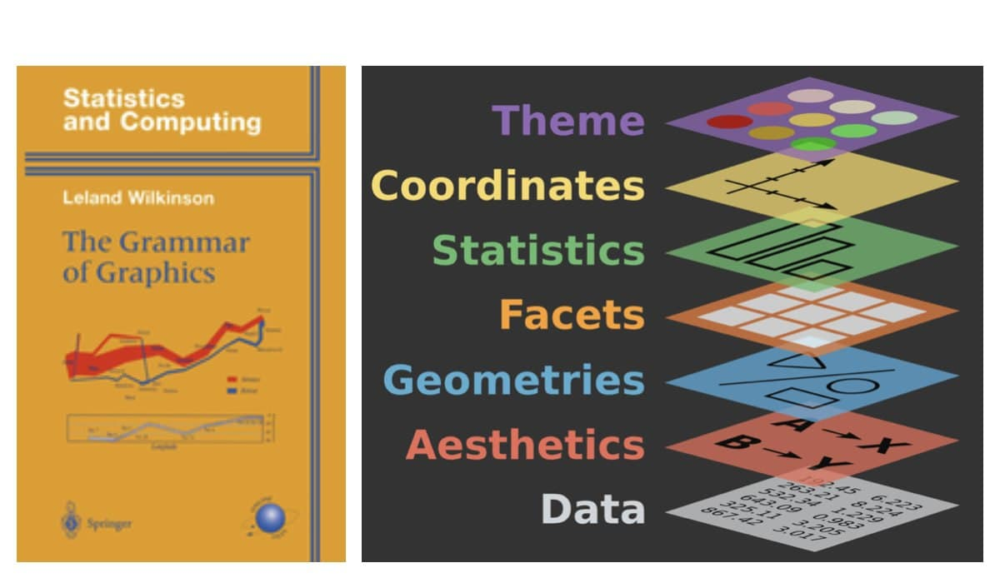

# Graficando con `R`

Una de las razones por las que muchas personas optan por utilizar lenguajes como `R` o `Python` para el análisis de datos es la posibilidad de generar gráficos de alta calidad de manera sencilla. Particularmente, `R` dispone de una variada cantidad de librerías para la generación de información gráfica que es digna de explorar. Cada una tiene su lógica y gramática propia.

Una **gramática de gráficos** es un conjunto de reglas y principios que definen cómo construir e interpretar gráficos. Estas gramáticas permiten generar visualizaciones de datos de manera sistemática y flexible. En `R`, la librería `ggplot2` [@wickham2010] es la más utilizada para estos fines. La misma forma parte del paquete `tidyverse` y es una implementación de la gramática de gráficos de Wilkinson [@wilkinson2005].

La idea de tener como fundamento una gramática es que iremos componiendo nuestros gráficos a partir de elementos independientes entre sí, sin tener que limitarnos a un número específico de gráficos predefinidos. `ggplot2` funciona en forma iterativa, es decir, iremos agregando capas de información a un gráfico básico, partiendo desde los datos crudos, hasta llegar a agregar geometrías y anotaciones. Veremos cómo esta forma de trabajo reducirá la distancia entre lo que pensamos y lo que finalmente queda en la visualización. De lo que se trata es de armar un gráfico sin hacer un solo *point and click*, ni depender de nuestro pulso de artista.



Como se observa en esquema anterior, partiendo desde los datos con lo que contamos, tenemos seis capas posibles para superponer y editar, dando forma a nuestro gráfico:  

1. **Datos**: los datos que queremos visualizar.
2. **Estética**: cómo se mapean los datos a los elementos visuales. Qué ira al eje *x* y al eje *y*, que elementos diferenciaremos por color, forma, tamaño, etc.  
3. **Elementos geométricos**: qué tipo de geometrías utilizaremos. Pueden ser líneas, puntos, barras, polígonos, etc. O pueden ser combinaciones más complejas: *boxplot*, histogramas, mapas de calor, etc.  
4. **Facetados**: cómo dividir los datos en subgráficos según alguna variable de interés.
5. **Estadísticas**: cómo resumir los datos antes de graficarlos. Por ejemplo, contar los casos, ajustarlos a un modelo lineal, etc.  
6. **Coordenadas**: sistema de coordenadas utilizado.
7. **Temas**: aspecto visual del gráfico. Fuentes, tamaño de letra, títulos, subtítulos, etc. Hay temas predefinidos que ya vienen en la librería.  

Con esta breve introducción, estamos en condiciones de construir nuestro primer gráfico en `R`.  

## Recursos a explorar 

La web está llena de ejemplos e ideas que nos pueden inspirar para construir nuestros gráficos. Una buena página para explorar es [R Graph Gallery](https://www.r-graph-gallery.com/). Allí encontraremos una gran cantidad de ejemplos de gráficos realizados con `R`, con el código fuente para replicarlos. Además, propone una buena clasificación de los gráficos según su tipo, lo que nos puede ayudar a encontrar rápidamente el tipo de gráfico que necesitamos.

Particularmente sobre `ggplot2`, sería recomendable que consulten el siguiente material:

- [R para Ciencia de Datos](https://es.r4ds.hadley.nz/03-visualize.html){target="_blank"}: en el capítulo 3 del libro encontrarán una breve guía para trabajar con `ggplot2`.

- [ggplot2: Elegant Graphics for Data Analysis](https://ggplot2-book.org/){target="_blank"}: este es el libro oficial de `ggplot2`, escrito por Hadley Wickham, su creador. En el sitio encontrarán una versión online del libro, con ejemplos y explicaciones detalladas.  

- [Machete de ggplot2](https://rstudio.github.io/cheatsheets/translations/spanish/data-visualization_es.pdf): una guía rápida con los principales comandos de `ggplot2`.


Otra fuente similar a la anterior es [Data to Viz](https://www.data-to-viz.com/), donde también encontraremos una guía para elegir el tipo de gráfico adecuado según los datos que tengamos.

Por otro lado, existen dos librerías que no exploraremos en el seminario pero que son de gran interés:  

- `plotly`: permite generar gráficos interactivos. [https://plotly.com/r/](https://plotly.com/r/) 
- `gganimate`: permite generar gráficos animados. [https://gganimate.com/](https://gganimate.com/)


## Librerías y bases que utilizaremos

Vamos a instalar estas librerías:

```{r eval=FALSE}
install.packages("scales")
```

Vamos a activar las siguientes librerías:

```{r}
library(tidyverse)
library(scales)
```

Vamos a cargar las bases de datos que utilizaremos:

```{r }
graduadxs_universit <- read_csv("https://cdn.produccion.gob.ar/cdn-cep/araucano/base_araucano.csv")

turismo_emisivo <- read_csv("https://datos.yvera.gob.ar/dataset/4cbf7d4a-702a-4911-8c1e-717a45214902/resource/fd710cb7-1981-43ea-aba3-7a14c356446b/download/turistas-residentes-serie.csv")

consumos_culturales <- read_csv("https://datos.cultura.gob.ar/dataset/251c2ac2-e670-451c-9dbf-a4212af225b5/resource/b635d1fc-2161-4901-a21d-7f93d56d99a4/download/base-datos-encc-2022-2023.csv")
```

Para la construcción de los gráficos vamos a transformar y crear algunas variables siguiendo los procedimientos aprendidos hasta ahora.

```{r message=FALSE, warning=FALSE}
graduadxs_universit <- graduadxs_universit %>%
  filter(anio == 2021) %>% # Me quedo solo con los datos de 2021
  mutate(
    edad_egreso = anioegreso - anionac, # Calculo la edad al egreso
    genero = factor(genero_id, labels = c("Mujer", "Varón")), # Transformo a factor la variable género
    rama_f = factor(rama_id,   labels = c("Ciencias Sociales",
                                          "Ciencias Aplicadas",
                                          "Ciencias de la Salud",
                                          "Ciencias Humanas",
                                          "Ciencias Básicas",
                                          "Sin Rama"
                                          ))
    )

```


## Construyendo el primer gráfico (paso a paso) 

Vamos a comenzar construyendo un gráfico sencillo, pero lo haremos paso a paso, para que luego podamos ir agregando complejidad en su composición. Vamos a trabajar sobre la base de microdatos de **personas graduadas de carreras universitarias registradas en el Sistema Araucano de la Secretaría de Políticas Universitarias (SPU) entre los años 2016 y 2018**. Tomaremos como variable de interés la edad de egreso (`edad_egreso`). El primer paso será llamar a la función `ggplot()` y pasarle como argumento la base de datos sobre la que queremos graficar.  

```{r}
ggplot(data = graduadxs_universit)

```

Esto nos devolverá como resultado, una hoja en blanco, ya que no le hemos indicado qué queremos graficar. Entonces, el siguiente paso será indicarle qué variable queremos graficar. Para ello, utilizaremos la función `aes()`, que nos permite *mapear* las variables de la base de datos a los elementos visuales del gráfico. En este caso, le pasaremos a `aes()` la variable `edad_egreso`.  

```{r}
ggplot(data = graduadxs_universit, aes(x = edad_egreso))

```
Ahora el gráfico se va llenando. Ha aparecido la escala del eje *x* referida a la edad de las personas. Pero aún no hemos indicado qué queremos hacer con esa variable. Para ello, vamos a agregar una capa geométrica, en este caso, le pediremos que grafique un histograma. 

```{r}
ggplot(data = graduadxs_universit, aes(x = edad_egreso)) +
  geom_histogram()

```
::: {.callout-tip title="Atención"}
Fijense que de forma similar al `%>%` de `dplyr`, en `ggplot2` utilizamos el `+` para ir agregando capas al gráfico. Es común que nos confundamos entre ambos operadores, pero con la práctica, iremos adquiriendo la costumbre de utilizarlos correctamente. 
:::


Dentro de la capa de geometría, podemos agregar argumentos que nos permitan personalizar el gráfico. Por ejemplo, cambiemos el color de las barras mediante la opción `fill` y el tamaño mediante la función `binwidth`. Pueden explorar las distintas formas de identificar las colores en este [sitio](https://r-graph-gallery.com/ggplot2-color.html).

```{r message=FALSE, warning=FALSE}
ggplot(data = graduadxs_universit, aes(x = edad_egreso)) +
  geom_histogram(fill = "skyblue", binwidth = 1)
```
Ahora el gráfico se ve algo mejor. Ahora veamos el tema de la escala. ¿Cómo podemos hacer para cambiar los intervalos y los límites tanto en el eje x como en el y. Vamos a utilizar las capas de *escalas* mediante las funciones `scale_x_continuous()` y `scale_y_continuous()`. Dentro de estas funciones, podemos indicar los intervalos (*breaks*) y los límites (*limits*) que queremos para cada eje. 

```{r message=FALSE, warning=FALSE}
ggplot(data = graduadxs_universit, aes(x = edad_egreso)) +
  geom_histogram(fill = "skyblue", binwidth = 1) +
  scale_x_continuous(breaks = seq(15, 70, 5), limits = c(15, 70)) +
  scale_y_continuous(breaks = seq(0, 30000,5000), limits = c(0, 30000))
```

La opción `breaks = seq(15, 70, 5)` indica que queremos que los intervalos en el eje *x* sean de 5 en 5, desde 15 hasta 90. La opción `limits = c(15, 70)` indica que los límites del eje *x* serán de 15 a 90. De forma similar, para el eje *y*, los intervalos serán de 5000 en 5000, desde 0 hasta 30000. Los límites del eje *y* serán de 0 a 30000.

Ahora bien, para cerrar nuestro primer gráfico, vamos a agregarle un título y etiquetas a los ejes. Para ello, utilizaremos la función `labs()`. A su vez, podemos también modificar el tema visual del gráfico mediante la función `theme()`. Seleccionaremos el tema *minimal* mediante la capa `theme_minimal()`.  

```{r}
ggplot(data = graduadxs_universit, aes(x = edad_egreso)) +
  geom_histogram(fill = "skyblue", binwidth = 1) +
  scale_x_continuous(breaks = seq(15, 70, 5), limits = c(15, 70)) +
  scale_y_continuous(breaks = seq(0, 30000,5000), limits = c(0, 30000)) +
  labs(title = "Distribución de graduadxs universitarios según edad.",
       subtitle = "Argentina 2016-2018.",
       caption = "Fuente: elaboración propia en base a Sistema Araucano de la Secretaría de Políticas Universitarias (SPU)",
       x = "Edad al egreso",
       y = "Cantidad de personas") +
  theme_minimal()

```

Si queremos exportar el gráfico a un archivo, para luego utilizarlo en algún documento o compartirlo, podemos hacerlo mediante la función `ggsave()`. Esta función nos permite guardar el gráfico en distintos formatos, como `pdf`, `png`, `jpeg`, `tiff`, entre otros.  


```{r}
ggplot(data = graduadxs_universit, aes(x = edad_egreso)) +
  geom_histogram(fill = "skyblue", binwidth = 1) +
  scale_x_continuous(breaks = seq(15, 70, 5), limits = c(15, 70)) +
  scale_y_continuous(breaks = seq(0, 30000,5000), limits = c(0, 30000)) +
  labs(title = "Distribución de graduadxs universitarios según edad.",
       subtitle = "Argentina 2016-2018.",
       caption = "Fuente: elaboración propia en base a Sistema Araucano de la Secretaría de Políticas Universitarias (SPU)",
       x = "Edad al egreso",
       y = "Cantidad de personas") +
  theme_minimal()

ggsave("resultados/grafico_edad.jpeg", width = 8, height = 5, dpi = 300)

```


### Observando diferencias por grupos  

Siguiendo con el gráfico que fuimos contruyendo, vamos a ver como hacer para comparar la distribución por edad según rama científica. Para ello, vamos a utilizar la variable `rama_f`. El principal cambio que vamos a generar en nuestras capas es que en la opción *fill* de la capa `aes()` vamos a indicar que queremos diferenciar por rama.  


```{r}
ggplot(data = graduadxs_universit, aes(x = edad_egreso, fill = rama_f)) +
  geom_histogram(binwidth = 1, position = "identity") +
  scale_x_continuous(breaks = seq(15, 70, 5), limits = c(15, 70)) +
  scale_y_continuous(breaks = seq(0, 11000,1000), limits = c(0, 11000)) +
  labs(title = "Distribución de graduadxs universitarios según edad y rama.",
       subtitle = "Argentina 2016-2018.",
       caption = "Fuente: elaboración propia en base a Sistema Araucano de la Secretaría de Políticas Universitarias (SPU)",
       x = "Edad al egreso",
       y = "Cantidad de personas") +
  theme_minimal()
```

Podríamos mejorar la gráfica retocando la transparencia de las barras mediante la opción *alpha* en `geom_histogram` y definiendo el título de la leyenda en la capa `labs`.


```{r}
ggplot(data = graduadxs_universit, aes(x = edad_egreso, fill = rama_f)) +
  geom_histogram(binwidth = 1, position = "identity", alpha = 0.4) +
  scale_x_continuous(breaks = seq(15, 70, 5), limits = c(15, 70)) +
  scale_y_continuous(breaks = seq(0, 11000,1000), limits = c(0, 11000)) +
  labs(title = "Distribución de graduadxs universitarios según edad y rama.",
       subtitle = "Argentina 2016-2018.",
       caption = "Fuente: elaboración propia en base a Sistema Araucano de la Secretaría de Políticas Universitarias (SPU)",
       x = "Edad al egreso",
       y = "Cantidad de personas",
       fill = "Rama científica") +
  theme_minimal()

```

Otra forma de evaluar las diferenciaciones por grupos es mediante *facetados*. Vamos a ver cómo hacer para que el gráfico se divida en dos paneles, uno para cada sexo. Para ello, vamos a utilizar la función `facet_wrap()` y le pasaremos como argumento la variable `genero`.  

```{r}
ggplot(data = graduadxs_universit, aes(x = edad_egreso, fill = rama_f)) +
  geom_histogram(binwidth = 1, position = "identity", alpha = 0.4) +
  scale_x_continuous(breaks = seq(15, 70, 5), limits = c(15, 70)) +
  scale_y_continuous(breaks = seq(0, 7000,1000), limits = c(0, 7000)) +
  labs(title = "Distribución de graduadxs universitarios según edad y género.",
       subtitle = "Argentina 2016-2018.",
       caption = "Fuente: elaboración propia en base a Sistema Araucano de la Secretaría de Políticas Universitarias (SPU)",
       x = "Edad al egreso",
       y = "Cantidad de personas",
       fill = "Rama científica") +
  theme_minimal() +
  facet_wrap(~genero)

```

## Gráficos de tendencias  

Ahora vamos a construir un gráfico de tendencias que nos permita observar, utilizando la base de datos de **Turismo emisivo**, cómo ha evolucionado la salida de turistas desde argentina entre 2016 y 2025. Para ello, nuevamente, vamos a construir primero una tabla en donde tengamos agrupada la cantidad de salidas por año-mes, utilizando las funciones `group_by` y `summarise` combinadas.  

Una vez construida la tabla, mediante el %>% podemos continuar con la construcción del gráfico mediante `ggplot`. En la estética indicaremos que nuestro eje [x]{.mark} es la variable *indice_tiempo* y el eje [y]{.mark} es *cantidad*. La geometría que utilizaremos aquí será `geom_line`.  

```{r}
turismo_emisivo %>% 
  group_by(indice_tiempo) %>% 
  summarise(cantidad = sum(viajes_de_turistas_residentes)) %>% 
  ggplot(aes(x = indice_tiempo, y = cantidad)) +
  geom_line()

```
Si bien el gráfico ya es bastante claro en lo que quiere transmitir, podemos seguir mejorándolo:  

- Mediante `scale_x_date` podemos mejorar la escala del eje *x* para que los intervalos sean de 6 meses y el formato de la fecha sea año-mes.  
- Mediante `theme` podemos rotar los textos del eje *x* para que se vean mejor.  
- Agregaremos títulos y fuente

```{r}
turismo_emisivo %>% 
  group_by(indice_tiempo) %>% 
  summarise(cantidad = sum(viajes_de_turistas_residentes)) %>% 
  ggplot(aes(x = indice_tiempo, y = cantidad)) +
  geom_line() +
  scale_x_date(date_breaks = "6 months", date_labels = "%Y-%m") +
  labs(
    title = "Evolución del turismo emisivo. 2016-2025.",
    caption = "Fuente: elaboración propia en base a datos de Yvera.gob.ar",
    x = "Año-Mes",
    y = "Cantidad de turistas residentes"
  ) +
  theme(
    axis.text.x = element_text(angle = 45, hjust = 1)
  )
```

Ahora el gráfico tiene un mejor aspecto y ya nos permite comprender como los ciclos económicos del país pueden verse expresados en la las fluctuaciones del turismo emisivo.  

Aun podemos agregar detalles que mejorarán el aspecto del gráfico. Por ejemplo, podemos remarcar con un color distintos el momento de la pandemia en donde el turismo alcanzó los niveles más bajos, durante 2020 y 2022. También, podemos identificar con puntos los momentos de mayor turismo emisivo y agregar una etiqueta que explique, brevemente, a qué se debió.  

- Con la función `annotate` podemos agregar un rectángulo que marque el período de la pandemia y podemos escribir texto en los lugares del gráfico que necesitemos.
- Con `geom_point` podemos agregar puntos en los momentos de mayor turismo emisivo, filtrando aquellos que nos interesan.

```{r}
turismo_emisivo %>% 
  group_by(indice_tiempo) %>% 
  summarise(cantidad = sum(viajes_de_turistas_residentes)) %>% 
  ggplot(aes(x = indice_tiempo, y = cantidad)) +
  geom_line() +
  annotate(
    "rect", xmin = as.Date("2020-03-01"), xmax = as.Date("2021-10-01"),
    ymin = -Inf, ymax = Inf, alpha = 0.2, fill = "red"
  ) +
  annotate("text", x = as.Date("2020-12-01"), y = 800000, label = "Pandemia", color = "red", size = 3) +
  geom_point(data = subset(turismo_emisivo %>% 
                             filter(indice_tiempo %in% c("2025-01-01", "2018-01-01")) %>%
                             group_by(indice_tiempo) %>% 
                             summarise(cantidad = sum(viajes_de_turistas_residentes))),
             aes(x = indice_tiempo, y = cantidad), color = "red", size = 2) +
  annotate("text", x = as.Date("2023-01-01"), y = 2000000, label = "Apreciación cambiaria Milei", color = "red", size = 3, hjust = 0) +
  annotate("text", x = as.Date("2018-02-01"), y = 2000000, label = "Apreciación cambiaria Macri", color = "red", size = 3, hjust = 0) +
  scale_x_date(date_breaks = "6 months", date_labels = "%Y-%m") +
  labs(
    title = "Evolución del turismo emisivo. 2016-2025.",
    caption = "Fuente: elaboración propia en base a datos de Yvera.gob.ar",
    x = "Año-Mes",
    y = "Cantidad de turistas residentes"
  ) +
  theme(
    axis.text.x = element_text(angle = 45, hjust = 1)
  )
```

```{r}
turismo_emisivo %>%
  filter(pais_destino %in% c("Chile", "Brasil")) %>% 
  group_by(indice_tiempo, pais_destino) %>% 
  summarise(cantidad = sum(viajes_de_turistas_residentes)) %>% 
  ggplot(aes(x = indice_tiempo, y = cantidad, color = pais_destino)) +
  geom_line() +
  scale_x_date(date_breaks = "6 months", date_labels = "%Y-%m") +
  labs(
    title = "Evolución del turismo emisivo. 2016-2025.",
    caption = "Fuente: elaboración propia en base a datos de Yvera.gob.ar",
    x = "Año-Mes",
    y = "Cantidad de turistas residentes",
    color = "País de destino"
  ) +
  theme(
    axis.text.x = element_text(angle = 45, hjust = 1)
  )
```
 
## Gráficos de barras  

Uno de los gráficos más utilizados en ciencias sociales para observar la distribución de las variables categóricas son los gráficos de barras. Por ejemplo, a partir de los datos agregados que generamos en la clase 5 utilizando la base de datos de la **Encuesta de Consumos Culturales 2022-2023**, podemos reconstruir el gráfico de la página 14 del informe de dicha encuesta. Este gráfico nos muestra, a través de barras, el porcentaje de personas que consumen los distintos tipos de géneros en plataformas digitales.   

Como vamos a querer que los valores del [eje y]{.mark} se presenten en porcentajes, primero vamos a calcular la proporción de personas en cada categoría. Para ello, utilizaremos la función `summarise` de `dplyr`. Asignaremos la nueva tabla agregada al objeto **plataformas**.  

```{r}
plataformas <- consumos_culturales %>% 
  summarise(accion_aventura = sum(ponderador[tv15_1 == 1], na.rm = T) / sum(ponderador, na.rm = T),
            ciencia_ficcion = sum(ponderador[tv15_2 == 1], na.rm = T) / sum(ponderador, na.rm = T),
            suspenso = sum(ponderador[tv15_3 == 1], na.rm = T) / sum(ponderador, na.rm = T),
            terror = sum(ponderador[tv15_4 == 1], na.rm = T) / sum(ponderador, na.rm = T),
            drama = sum(ponderador[tv15_5 == 1], na.rm = T) / sum(ponderador, na.rm = T),
            comedia = sum(ponderador[tv15_6 == 1], na.rm = T) / sum(ponderador, na.rm = T),
            romantico = sum(ponderador[tv15_7 == 1], na.rm = T) / sum(ponderador, na.rm = T),
            documental = sum(ponderador[tv15_8 == 1], na.rm = T) / sum(ponderador, na.rm = T),
            infantiles = sum(ponderador[tv15_9 == 1], na.rm = T) / sum(ponderador, na.rm = T),
            entretenimiento_reality = sum(ponderador[tv15_10 == 1], na.rm = T) / sum(ponderador, na.rm = T),
            animacion = sum(ponderador[tv15_11 == 1], na.rm = T) / sum(ponderador, na.rm = T))
```

Sin embargo, para poder graficar con `ggplot2`, necesitamos que la tabla esté en formato *largo*. Por ello, vamos a utilizar la función `pivot_longer` de `tidyr`. En esta función, le pasaremos como argumento las columnas que queremos transformar a formato largo, el nombre de la nueva columna que contendrá los nombres de las categorías y el nombre de la nueva columna que contendrá los valores de proporción. 

```{r}
plataformas <- plataformas %>% 
  pivot_longer(cols = everything(), 
               names_to = "genero", 
               values_to = "prop")
```


Ahora estamos en condiciones de probar la función `geom_bar` para construir un gráfico de barras. Es importante declarar `stat = "identity"` para que las barras se muestren en función de la proporción de personas en cada categoría. 


```{r}
ggplot(data = plataformas, aes(x = genero, y = prop)) +
  geom_bar(stat = "identity", fill = "skyblue") +
  labs(title = "Distribución de la población según género preferido en plataformas digitales",
       caption = "Fuente: elaboración propia en base a Encuesta de Consumos Culturales 2022-2023",
       x = "Género",
       y = "Proporción de personas") +
  theme_minimal() +
  scale_y_continuous(labels = percent_format())

```

Como las etiquetas de las columnas se solapan entre sí, lo mejor es invertir el eje [x]{.mark} y el eje [y]{.mark} mediante la función `coord_flip`. Además podemos ordenar las barras en dirección descendente con la función `reorder` en la parte de la estética.  

```{r}
ggplot(data = plataformas, aes(x = reorder(genero, prop), y = prop)) +
  geom_bar(stat = "identity", fill = "skyblue") +
  labs(title = "Distribución de la población según género preferido en plataformas digitales",
       caption = "Fuente: elaboración propia en base a Encuesta de Consumos Culturales 2022-2023",
       x = "Género",
       y = "Proporción de personas") +
  theme_minimal() +
  scale_y_continuous(labels = percent_format()) +
  coord_flip()
```


Ahora bien, existen otros formatos de gráficos de barras que nos permiten representar un cruce de variables, tal cómo lo hicimos en la clase anterior al elaborar tablas de contingencia. Por ejemplo, podríamos preguntarnos si el gusto por determinados géneros varía por género. Para ello, primero vamos a calcular los porcentajes por género. Luego, vamos a pasar en la capa `aes()` en la opción `fill`, la variable `genero`. Al mismo tiempo, en la capa `geom_bar` indicaremos la opción `position = "dodge"`. 

```{r}
plataformas <- consumos_culturales %>% 
  filter(genero != "No binario") %>% 
  group_by(genero) %>% 
  summarise(accion_aventura = sum(ponderador[tv15_1 == 1], na.rm = T) / sum(ponderador, na.rm = T),
            ciencia_ficcion = sum(ponderador[tv15_2 == 1], na.rm = T) / sum(ponderador, na.rm = T),
            suspenso = sum(ponderador[tv15_3 == 1], na.rm = T) / sum(ponderador, na.rm = T),
            terror = sum(ponderador[tv15_4 == 1], na.rm = T) / sum(ponderador, na.rm = T),
            drama = sum(ponderador[tv15_5 == 1], na.rm = T) / sum(ponderador, na.rm = T),
            comedia = sum(ponderador[tv15_6 == 1], na.rm = T) / sum(ponderador, na.rm = T),
            romantico = sum(ponderador[tv15_7 == 1], na.rm = T) / sum(ponderador, na.rm = T),
            documental = sum(ponderador[tv15_8 == 1], na.rm = T) / sum(ponderador, na.rm = T),
            infantiles = sum(ponderador[tv15_9 == 1], na.rm = T) / sum(ponderador, na.rm = T),
            entretenimiento_reality = sum(ponderador[tv15_10 == 1], na.rm = T) / sum(ponderador, na.rm = T),
            animacion = sum(ponderador[tv15_11 == 1], na.rm = T) / sum(ponderador, na.rm = T)) %>% 
  pivot_longer(cols = -genero, 
               names_to = "genero_plataforma", 
               values_to = "prop")

plataformas %>% 
  ggplot(aes(x = reorder(genero_plataforma, prop), y = prop, fill = genero)) +
  geom_bar(stat = "identity", position = "dodge") +
  labs(title = "Distribución de la población según género preferido en plataformas digitales y sexo",
       caption = "Fuente: elaboración propia en base a Encuesta de Consumos Culturales 2022-2023",
       x = "Género",
       y = "Proporción de personas",
       fill = "Sexo") +
  theme_minimal() +
  scale_y_continuous(labels = percent_format()) +
  coord_flip()

```

La otra opción es utilizar *barras apiladas*. Para ello, en la capa `geom_bar` indicaremos la opción `position = "fill"`. 

```{r}
plataformas %>% 
  ggplot(aes(x = reorder(genero_plataforma, prop), y = prop, fill = genero)) +
  geom_bar(stat = "identity", position = "fill") +
  labs(title = "Distribución de la población según género preferido en plataformas digitales y sexo",
       caption = "Fuente: elaboración propia en base a Encuesta de Consumos Culturales 2022-2023",
       x = "Género",
       y = "Proporción de personas",
       fill = "Sexo") +
  theme_minimal() +
  scale_y_continuous(labels = percent_format()) +
  coord_flip()

```

Si además queremos agregar una capa de texto con el valor de la proporción de personas en cada categoría, podemos hacerlo mediante la función `geom_text()`. En esta función, le pasaremos como argumento la opción `label = percent(prop)`, que nos permitirá mostrar el valor de la proporción en formato porcentaje. 

Por otro lado, si queremos que las etiquetas de los distintos géneros se muestren en forma apropiada, podemos indicarlo a traves de la capa `scale_x_discrete`, utilizando la opción *labels*.

```{r}
plataformas %>% 
  ggplot(aes(x = reorder(genero_plataforma, prop), y = prop, fill = genero)) +
  geom_bar(stat = "identity", position = "fill") +
  geom_text(aes(label = scales::percent(prop, accuracy = 0.1)), position = position_fill(vjust = 0.5), size = 3) +
  labs(title = "Distribución de la población según género preferido en plataformas digitales y sexo",
       caption = "Fuente: elaboración propia en base a Encuesta de Consumos Culturales 2022-2023",
       x = "Género",
       y = "Proporción de personas",
       fill = "Sexo") +
  theme_minimal() +
  scale_y_continuous(labels = percent_format()) +
  scale_x_discrete(labels = c("accion_aventura" = "Acción/Aventura",
                               "ciencia_ficcion" = "Ciencia ficción",
                               "suspenso" = "Suspenso",
                               "terror" = "Terror",
                               "drama" = "Drama",
                               "comedia" = "Comedia",
                               "romantico" = "Romántico",
                               "documental" = "Documental",
                               "infantiles" = "Infantiles",
                               "entretenimiento_reality" = "Entretenimiento/Reality",
                               "animacion" = "Animación")) +
  coord_flip()

```

